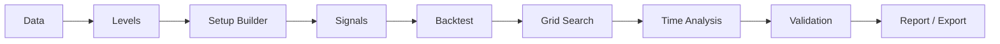

# ARCHITECTURE

## End-to-end data flow



Flow basis in app workflow and phase pages: `app.py:12-33`, `pages/1_Data.py`, `pages/5_Levels.py`, `pages/2_Setup_Builder.py`, `pages/6_Signals.py`, `pages/7_Backtest.py`, `pages/8_Grid_Search.py`, `pages/9_Time_Analysis.py`, `pages/10_Validation.py`, `pages/11_Report_Export.py`.

Backtest UI note: `pages/7_Backtest.py` shows both combined KPIs and a separate directional
("Long vs Short KPIs") section sourced from the same `trades` DataFrame.

Grid Search directional note: `pages/8_Grid_Search.py` shows aggregate KPIs by default.
Enable **Advanced directional ranking** to rank by long/short or balanced weaker-side
metrics with per-side minimum trade-count gates.  Each grid row includes `long_*`,
`short_*`, and `min_direction_*` columns computed by
`thesistester.analytics.grid._directional_grid_metrics`.

## `st.session_state` contract (current)

| Key | Producing page(s) | Consuming page(s) | Schema (observed) |
|---|---|---|---|
| `data` | Data (`pages/1_Data.py:114`) | Levels (`pages/5_Levels.py:203-217,425`), Backtest (`pages/7_Backtest.py:64-68`), Grid (`pages/8_Grid_Search.py:36-40`), Report/Bundles (`pages/12_Research_Bundles.py:26`) | `pd.DataFrame` OHLCV/session columns |
| `resampled_data` | Data (`pages/1_Data.py:115`) | Data summary (`pages/1_Data.py:341`) | `dict[str, pd.DataFrame]` |
| `instrument` | Data (`pages/1_Data.py:116`) | Levels/Setup/Signals/Backtest/Grid/Time (`pages/5_Levels.py:207`, `pages/2_Setup_Builder.py:67`, `pages/6_Signals.py`, `pages/7_Backtest.py:70`, `pages/8_Grid_Search.py:42`, `pages/9_Time_Analysis.py:30`) | `str` (e.g., `ES`, `NQ`) |
| `base_interval` | Data (`pages/1_Data.py:117`) | Levels fingerprint (`pages/5_Levels.py:84`), dataset persistence (`pages/1_Data.py:357`) | `str \| None` |
| `source_timezone` | Data (`pages/1_Data.py:118`) | Levels fingerprint (`pages/5_Levels.py:85`), dataset persistence (`pages/1_Data.py:358`) | `str \| None` |
| `exchange_timezone` | Data (`pages/1_Data.py:119`) | Levels fingerprint (`pages/5_Levels.py:86`), Backtest/Report TZ handling (`pages/7_Backtest.py:74-75`, `pages/11_Report_Export.py:24-33`) | `str \| None` |
| `display_timezone` | Data/Backtest/Time/Report widgets (`pages/1_Data.py:120-123`, `pages/7_Backtest.py:85-90`, `pages/9_Time_Analysis.py:68-73`, `pages/11_Report_Export.py:26-33`) | Time/Report export conversions (`pages/9_Time_Analysis.py:109`, `pages/11_Report_Export.py:33,129-133`) | `str` |
| `dataset_id` | Data (`pages/1_Data.py:124,361`) | Levels/Signals persistence (`pages/5_Levels.py:208-217`, `pages/6_Signals.py`) | `str` |
| `levels` | Levels (`pages/5_Levels.py:186,455`) | Setup/Signals/Backtest/Grid/Report/Bundles (`pages/2_Setup_Builder.py:62-67`, `pages/6_Signals.py`, `pages/7_Backtest.py:62-63`, `pages/8_Grid_Search.py:34-35`, `pages/12_Research_Bundles.py:30`) | `pd.DataFrame` OHLCV + derived level columns |
| `session_levels` | Levels (`pages/5_Levels.py:187,454`) | Bundles/save (`pages/5_Levels.py:497`, `pages/12_Research_Bundles.py:30`) | `pd.DataFrame` session-level table |
| `levels_settings` | Levels (`pages/5_Levels.py:188,456`) | Levels stale checks (`pages/5_Levels.py:323`), Signals persistence context (`pages/6_Signals.py`) | `dict` |
| `levels_data_fingerprint` | Levels (`pages/5_Levels.py:189,457`) | Levels stale checks (`pages/5_Levels.py:324-336`) | `dict` |
| `setup_config` | Setup Builder (`pages/2_Setup_Builder.py:200`), Signals saved-run copy action (`pages/6_Signals.py`) | Signals setup-source selection (`pages/6_Signals.py`), Report (`pages/11_Report_Export.py:36-43`) | `dict` setup configuration |
| `setup_configs` | Setup Builder (`pages/2_Setup_Builder.py:201-205`) | Setup Builder only | `list[dict]` |
| `confluence_zones` | Signals (`pages/6_Signals.py`) | Signals display (`pages/6_Signals.py`), Backtest chart overlay (`pages/7_Backtest.py:294-300`), Bundles (`pages/12_Research_Bundles.py:36`) | `pd.DataFrame` zone rows |
| `naked_flags` | Signals (`pages/6_Signals.py`) | Signals logic/save (`pages/6_Signals.py`), Bundles (`pages/12_Research_Bundles.py:37`) | `pd.DataFrame` naked-level flags |
| `signals` | Signals (`pages/6_Signals.py`) | Backtest/Grid/Report/Bundles (`pages/7_Backtest.py:48-56`, `pages/8_Grid_Search.py:21-29`, `pages/11_Report_Export.py:38-39`, `pages/12_Research_Bundles.py:35`) | `pd.DataFrame` candidate/fill signal rows |
| `signal_settings` | Signals (`pages/6_Signals.py`) | Signals save consistency checks (`pages/6_Signals.py`) | `dict` |
| `signal_settings_hash` | Signals (`pages/6_Signals.py`) | Signals save/load matching (`pages/6_Signals.py`) | `str` |
| `signal_context` | Signals (`pages/6_Signals.py`) | Backtest caption (`pages/7_Backtest.py:56,77`) | `dict` (`setup_name`, `confluence_mode`, `setup_caption`) |
| `last_signal_setup` | Signals (`pages/6_Signals.py`) | Signals persistence/report artifact (`pages/6_Signals.py`, `thesistester/reporting.py:146`) | `dict` |
| `trades` | Backtest (`pages/7_Backtest.py:156`) | Time/Validation/Report/Bundles (`pages/9_Time_Analysis.py:24`, `pages/10_Validation.py:21`, `pages/11_Report_Export.py:39`, `pages/12_Research_Bundles.py:42`) | `pd.DataFrame` simulated trade rows |
| `trade_summary` | Backtest (`pages/7_Backtest.py:157`) | Time/Report (`pages/9_Time_Analysis.py:39`, `thesistester/reporting.py:151`) | `dict` KPI summary |
| `equity_curve` | Backtest (`pages/7_Backtest.py:158`) | Backtest display/Report/Bundles (`pages/7_Backtest.py:163,207`, `pages/11_Report_Export.py:121-122`, `pages/12_Research_Bundles.py:42`) | `pd.DataFrame` cumulative-R curve |
| `grid_results` | Grid (`pages/8_Grid_Search.py:146`) | Validation/Report/Bundles (`pages/10_Validation.py:27`, `pages/11_Report_Export.py:40,123`, `pages/12_Research_Bundles.py:46`) | `pd.DataFrame` one row per SL/TP cell |
| `best_grid_result` | Grid (`pages/8_Grid_Search.py:147`) | Report artifact (`thesistester/reporting.py:152`) | `dict` best ranked cell |
| `time_bucketed_trades` | Time (`pages/9_Time_Analysis.py:129`) | Report/Bundles availability checks (`pages/12_Research_Bundles.py:57`) | `pd.DataFrame` trades + time-bucket columns |
| `time_grouped_summary` | Time (`pages/9_Time_Analysis.py:208`) | Report export (`pages/11_Report_Export.py:41,123`, `thesistester/reporting.py:180-185`) | `pd.DataFrame` grouped diagnostics |
| `validation_summary` | Validation (`pages/10_Validation.py:130`) | Validation display/Report/Bundles (`pages/10_Validation.py:134`, `pages/11_Report_Export.py:42,82-83`, `pages/12_Research_Bundles.py:50`) | `dict` (`bootstrap`, `permutation`, `trade_count`, `grid_overfit`) |

## Local persistence topology (filesystem)

- Root: `.thesistester_store/` (or `$THESISTESTER_STORE_DIR`)
- Datasets: `.thesistester_store/datasets/<dataset_id>/`
- Levels: `.thesistester_store/levels/<dataset_id>/<levels_settings_hash>/`
- Signal runs: `.thesistester_store/signals/<dataset_id>/<levels_settings_hash>/<signal_settings_hash>/`
- Setups: `.thesistester_store/setups/<setup_id>/meta.json`
- UI state (active dataset, execution defaults): `.thesistester_store/ui_state.json`

### `ui_state.json` namespaces

| Key | Purpose |
|---|---|
| `active_dataset_id` | Currently selected dataset |
| `active_levels_hash_by_dataset` | Persisted levels-hash per dataset |
| `backtest_defaults` | Saved Backtest execution-settings defaults (see below) |
| `grid_defaults` | Saved Grid Search execution-settings defaults (see below) |

### Execution-settings defaults (`backtest_defaults` / `grid_defaults`)

Both namespaces are written to `ui_state.json` and follow the same pattern:

```json
{
  "backtest_defaults": {
    "defaults_schema_version": 1,
    "sl_ticks": 8.0,
    "tp_ticks": 16.0,
    "...": "..."
  },
  "grid_defaults": {
    "defaults_schema_version": 1,
    "sl_start": 4.0,
    "sl_stop": 20.0,
    "...": "..."
  }
}
```

Key properties:
- Namespaces are **fully independent** — saving Backtest defaults never touches Grid defaults, and vice versa.
- Defaults are **versioned** (`defaults_schema_version`). A version mismatch causes saved defaults to be ignored silently; widgets fall back to their built-in values.
- Defaults are **loaded once per session** before widget rendering and injected only into absent `st.session_state` keys — user-edited values are never overwritten.
- Defaults are **never auto-saved**. They are persisted only when the user explicitly clicks **💾 Save execution settings as default**.
- Defaults can be **reset** with **↩ Reset to built-in defaults**, which clears the namespace from disk and removes the widget keys from `st.session_state`.
- Invalid or stale field values (out-of-range numbers, unknown policy/timezone/metric strings, malformed time strings, non-bool booleans) are **dropped silently** before injection — they never reach the engine.
- Clearing defaults removes only the relevant namespace; all other `ui_state.json` keys (e.g. `active_dataset_id`) are preserved.
- Engine/analytics code (`simulate_trades`, `run_sl_tp_grid`) is **unaffected** — it always receives explicit parameters from the UI.

Persistence API lives in `thesistester/persistence/local_store.py` (`get_backtest_defaults`, `save_backtest_defaults`, `clear_backtest_defaults`, `get_grid_defaults`, `save_grid_defaults`, `clear_grid_defaults`).
Validation/injection helpers live in `thesistester/execution_defaults.py`.

Setup persistence is local-only (no cloud sync/user accounts). Setup Builder stores setup
configs in the setup library and keeps `st.session_state["setup_config"]` as the active setup
for Signals compatibility. Signals now supports setup-source selection (manual, active setup,
saved setup library), with dataset-aware setup-library labels/filtering and compatibility checks
for missing level references. Saved signal runs also expose a copy action that restores a setup
snapshot back into Setup Builder session state for review/edit/save before persistence.

## Levels page opt-in level controls (Stage 6)

The Levels page (`pages/5_Levels.py`) exposes an **"Advanced opt-in levels"** expander below
existing profile settings. Controls inside it:

| Control | Default | Notes |
|---|---|---|
| Enable confirmed pivots | `False` | Shows pivot timeframes / left / right when enabled |
| Enable developing RTH VWAP (dVWAP_RTH) | `False` | Anchor fixed to RTH |
| Enable TPO 30m Single Prints | `False` | No additional config exposed |
| Enable APOC / pAPOC | `False` | Independent of Single Prints |

All eight gate values are included in the levels settings object and therefore in the
settings hash used for saved snapshot matching. `_normalize_levels_settings` adds disabled
defaults for all new keys so old saved snapshots remain compatible. `pivot_timeframes` is
sorted deterministically alongside the other list-valued settings.

When a saved snapshot is loaded, `_sync_levels_widget_state` restores all four new controls.
Old snapshots missing Stage 6 keys default new controls to disabled without raising errors.

No computation behavior changes when all new controls remain unchecked.
APOC / pAPOC are independent from Single Prints and are not routed through `compute_tpo_levels`.
Single Prints are implemented in `thesistester/levels/tpo.py`; APOC / pAPOC are implemented in `thesistester/levels/apoc.py`.
The Levels page writes these opt-in values into `st.session_state["levels_settings"]`, and saved snapshots include them via the levels settings hash.

The level engine remains scalar-column based: each enabled family contributes deterministic
columns onto the shared levels DataFrame, and downstream Signals/Backtest consume those columns
generically without stage-specific workflow changes.
