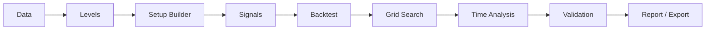

# ARCHITECTURE

## Packaging and tooling boundary (R9)

| Artifact | Packaged? | Notes |
|---|---|---|
| `thesistester/**` | Yes | The library. `pip install -e .` makes it importable outside Streamlit (`pyproject.toml`, `[tool.setuptools.packages.find] include = ["thesistester*"]`). |
| `app.py`, `pages/**` | No | Streamlit entry points; run from a repo checkout. |
| `tests/**` | No | Runs from the checkout; `testpaths = ["tests"]`. |

Consequence that matters for later milestones: `thesistester/app_state.py` is currently the
only library module that imports `streamlit` at module scope — data, levels, engine,
analytics, persistence, reporting, and visualization modules are Streamlit-free. That is what
makes the R18 headless facade a pure addition rather than a refactor. `streamlit`
nevertheless remains a hard dependency in `pyproject.toml` (mirroring `requirements.txt`);
R18 keeps it there to avoid changing the established install contract. Dependency ranges carry next-major
caps, and `requirements.txt` stays the app-install path.

Tool configuration is centralized in `pyproject.toml` (`ruff`, `pytest`, `coverage`).
CI jobs and the golden-master regeneration guard are defined in `.github/workflows/ci.yml`;
the golden fixture contract lives in `tests/fixtures/golden/README.md`.

R9 introduced **no** `st.session_state` keys and no engine/analytics behavior change, so the
contract table below is unchanged by it.

## Headless composition boundary (R18)

`thesistester/api.py` is an additional consumer of the same pure functions used
by the Streamlit pages. Its public path is `load_dataset → compute_levels →
build_setup → generate_signals → run_backtest → run_grid → run_validation`;
handoffs are typed `DataFrame`/`dict` values. It owns orchestration only: the
level, signal, OTF, simulation, grid, and validation implementations are
unchanged.

`thesistester/cli.py` validates experiment schema version 1, calls the facade,
and sends its bundle-ready mapping to `build_research_bundle()`.
`thesistester/__main__.py` supplies `python -m thesistester run ...`. Spawned
`ProcessPoolExecutor` workers isolate independent runs; no worker introduces
parallelism inside a single engine pipeline. Results are collected in YAML
order and summarized in `results_index.csv`.

## AI Research Assistant contract boundary (AIA-0)

`thesistester.assistant` is a Streamlit-free metadata boundary for the proposed
single-user AI Research Assistant. It currently defines versioned, JSON-safe
contracts, a feature-parity registry, and an additive local thesis repository.
It does not execute research, import Streamlit, or alter engine/analytics
behavior.

The registry records every user-visible product area as `executable`,
`inspect_only`, `import_export`, or `unsupported`, with its public symbol,
confirmation requirement, resource envelope, and any documented limitation.
Future assistant tools must validate an `AssistantRequest` against this registry
before execution and may only call declared public headless interfaces.
Undeclared and unsupported capability requests fail closed.

This boundary adds no `st.session_state` keys. A future assistant page must use
additive, namespaced keys and document them here in the same PR.

The Research Assistant page stages only these additive `assistant_*` keys
(source of truth: `ASSISTANT_SESSION_KEYS` in
`thesistester/assistant/workspace.py`):

| Key | Role |
|---|---|
| `assistant_selected_thesis_id` | Active thesis |
| `assistant_draft_prompt` | Staged prose prompt |
| `assistant_draft_choices` | Staged structured RunSpec sections |
| `assistant_conversation_ids` | `{thesis_id: conversation_id}` map |
| `assistant_hydrated_conversation_id` | Conversation hydration guard |
| `assistant_validated_run_spec` | `{choices, spec}` after validate |
| `assistant_run_explanations` | Deterministic explain cache by run_id |
| `assistant_llm_run_explanations` | Evidence-only LLM explain cache |
| `assistant_llm_attempts` | Provider attempt counts by run_id |
| `assistant_run_reports` | Markdown report cache by run_id |
| `assistant_run_artifacts` | Research artifact cache by run_id |
| `assistant_run_comparisons` | In-session comparison by thesis_id |
| `assistant_bundle_handoff` | Last hash-verified restore into research pages |

Thesis switches clear `THESIS_SCOPED_STAGING_KEYS` (`assistant_draft_prompt`,
`assistant_draft_choices`, `assistant_hydrated_conversation_id`,
`assistant_validated_run_spec`, `assistant_bundle_handoff`) so
draft/validation/hydration/handoff cannot leak. The Active handoff caption is
further gated by `active_bundle_handoff()` so a stale handoff never displays for
a different thesis.
`assistant_draft_choices` contains only supported structured RunSpec sections;
narrative LLM hints stay in conversation history and never become execution
candidates. Clarification checks trust only structured sections
(`levels.session_vwap_enabled`, `setup.tolerance_ticks`), never legacy flat
keys. Setup controls reject empty confluence-level lists so
`min_confluences`/`max_confluences` cannot claim levels that were not selected.
Enabled walk-forward controls persist explicit `window_mode` and
`overlap_policy` alongside fold sizes (sessions or bars), and canonical
compilation rejects enabled walk-forward blocks that omit those sizing fields
so API train/test defaults cannot be inferred at confirmation. Bundle handoff
restores managed research keys through
`AssistantOrchestrator.restore_run_bundle_to_session()` after hash verification;
it does not bypass existing research-page producers for new compute.

`LocalThesisRepository` stores schema-versioned thesis metadata, immutable
specification versions, requested/terminal run provenance, and append-only
conversations under `.thesistester_store/assistant/`. It writes assistant
documents atomically and fails closed on corrupt or newer schema records.
It does not read or modify research bundles or existing local-store namespaces.
Confirmation is an atomic compiler boundary: it accepts only a resolved
ready-for-confirmation draft, recompiles the typed structured choices into an
API RunSpec, and calls `validate_run_spec()` before writing an immutable
confirmed child. The orchestrator repeats that validation immediately before
execution. Narrative fields that have no public-pipeline mapping are rejected,
rather than being stored as executable assumptions.

`AssistantOrchestrator.for_local_workspace()` is the Streamlit entrypoint.
`dispatch()` remains the only compute router for registry capabilities. Workspace
façade methods wrap thesis/spec/run/conversation/comparison lifecycle,
validate/confirm, explain/compare/export/portfolio, and bundle handoff so the
Research Assistant page stays presentation-only. Plan review surfaces
clarifications only when the newest specification is still
`needs_clarification` (`latest_unresolved_assumptions()`). Drafting syncs
`normalized_run_spec` back into `assistant_draft_choices`. Numeric widget
defaults use `safe_int`/`safe_float` so malformed JSON/chat values cannot crash
rerenders. Bundle restore clears `assistant_validated_run_spec` and the page
reruns so the Active handoff caption refreshes immediately.
Explanations are packet-backed: `EvidencePacket` is schema-versioned and
includes structured caveats, limitations, claims, and next-experiment guidance.
`explain_evidence_report()` / `assert_claims_grounded()` ensure every displayed
numeric claim cites an evidence path and exact value. Optional LLM paraphrase
(`explain_packet_with_llm` / `AssistantOrchestrator.explain_run_with_llm`) is a
separate fail-closed gate: provider JSON must be exactly
`{summary, caveats, claims}` with claim `{text, path}` objects; the server
resolves `path` against the immutable packet, attaches the packet value, and
`assert_llm_explanation_grounded()` rejects any numeric token not present in
cited claim values (packet caveat message numbers may be echoed). The LLM never
executes tools, mutates confirmed specs, or bypasses confirmation. Without a
provider, deterministic explain/compare/export remains the default path.
`audit_capability_registry()` is the machine-readable release audit over
`FEATURE_PARITY_REGISTRY` × `HANDLER_REGISTRY`. Grid ranking-metric claims
ground to `assumptions.grid.ranking_metric` when `best_grid_result` omits that
field (typical grid row snapshots), and printed commission/slippage values are
claimed at `assumptions.costs_exposure.*`. Failure diagnostics claim
`provenance.error` or `results.error` according to where the message lives.
Top-level research-artifact `otf_validation` is projected into
`results.otf_validation` / `results.otf_validation_summary`, and OTF availability
claims cite `assumptions.otf_filter.available` or validation result paths only.
`intrabar_ambiguity` fires for non-`sl_first` models via
`assumptions.intrabar.intrabar_model` / `costs_exposure.intrabar_model` even when
`backtest_intrabar_diagnostic` is absent.
`compare_evidence()`
returns versioned nested evidence covering metrics, executable-spec diffs,
data comparability, conclusions, and next experiments. Persisted `Comparison`
records are schema v2 (`created_at`, `conclusions`); v1 records migrate on
read. `compare_completed_runs()` still returns computed comparison evidence when
immutable comparison persistence fails (`persistence_error`), so the UI is not
blocked by a save race. Report and research-artifact export remain independent
UI actions. Untouched execution drafts default `exposure_policy` to
`allow_all`. Confirm stays gated on `plan["ready_for_confirmation"]` so a
validated RunSpec cannot be confirmed while clarifications remain. WFA matrix
controls are sessions-fold-only (parity with Validation). Page code must not construct
`AssistantTools`, mutate `LocalThesisRepository`, compile RunSpecs, explain
evidence, or read bundle bytes directly. Provenance-gated bundle loads
(`BUNDLE.import`, `EXPORT.build_research_artifact`, `PORTFOLIO.analyze`) require
non-empty expected hashes and fail closed when they are missing or blank; they
never silently skip digest verification. `execute_confirmed_run` additionally
verifies that the written research bundle exists and that
`canonical_bundle_hash(on_disk_bytes)` matches the reported digest before any
run may transition to `completed`. Completed/cancelled run lifecycle outcomes
keep their terminal repository state even if conversation-audit append races.
`cancel_run()` returns a structured lifecycle failure when the target run is no
longer `running`, so stale Cancel clicks do not raise. If cancel wins while
execution is still finishing, the orchestrator keeps the cancelled terminal
state, attaches late bundle provenance when available, and does not attempt
`fail_run` against the already-terminal record. The Research Assistant UI reads
that returned status through `confirmed_run_feedback()` so a cancelled race is
not shown as a successful completion. List-style dispatches use
`list_payload_or_error()` so failed/gated outcomes surface as errors instead of
an empty “no items” success state. API/CLI/assistant parity for one fixed
fixture is gated by `tests/test_assistant_execution_parity.py`.

Research ZIP bytes include archive timestamps and are not deterministic.
`canonical_bundle_hash()` projects JSON with sorted keys (excluding
`manifest.created_at`) and parquet members through the repository DataFrame
hash before computing the final digest. This implements the golden-master
projection contract without changing bundle schema version 1.

R18 adds no `st.session_state` keys and does not route existing pages through
the facade. The session-state contract below is therefore unchanged.

## Intrabar execution boundary (R12)

`thesistester/engine/intrabar.py` owns deterministic event ordering only.
`simulate_trades()` retains trade admission, bracket prices, costs, bar-count
holding limits, forced exits, and parent-bar MAE/MFE. Its new keyword-only
inputs are `intrabar_model`, optional `subtimeframe_data`, and
`return_result`.

The default `sl_first` branch preserves the historical DataFrame schema and
return types exactly. `return_result=True` returns `SimulationResult` with
trades, skipped signals, and schema-versioned diagnostics. Non-legacy trades
append audit columns; existing columns are neither removed nor retyped.

`path_open_proximity` is a pure OHLC heuristic. `subtimeframe` has a strict
dual-resolution boundary: lower rows must be sorted, duplicate-free, strictly
finer, exactly divide the parent interval, completely cover every parent bar,
match every expected lower timestamp exactly, contain finite valid OHLC ranges,
and reconcile first-open/max-high/min-low/last-close. No interpolation,
upsampling, offset cadence, or silent fallback is permitted.
`subtimeframe_conservative` is a separate, opt-in mixed-resolution model:
complete reconciled groups use observed replay, while incomplete or misaligned
groups use the existing pessimistic SL-first rule and are exported in
diagnostics. Invalid OHLC and complete-group OHLC mismatches remain fatal.
The Data page can emit a read-only full-series compatibility CSV when such a
fatal lower-data mismatch occurs; it never mutates either uploaded dataset.

Grid and walk-forward runs hold one intrabar model fixed; the model is a market
path assumption, not an optimization dimension. R18 experiment schema version
1 remains backward compatible and accepts optional
`dataset.subtimeframe_path`.

## Exit-management boundary (R13)

R13 adds optional break-even and trailing stop management to
`simulate_trades()`. The fixed bracket still defines initial risk:
`stop_price` remains the initial stop, `target_price` remains fixed, and
R-multiple denominators remain unchanged. Dynamic stop state is held separately
and audited through `active_stop_price_at_exit`, activation bar indices, and
stop-adjustment columns only when the feature is enabled.

BE/trailing updates are committed after completed parent bars and become
active on the next bar. This keeps OHLC-only assumptions conservative and lets
R12 intrabar models resolve event order only for already-active stops.

Grid and walk-forward can sweep BE/trailing values, but the chosen policy is
stored explicitly so downstream validation and reports can distinguish
strategy parameters from market-path assumptions.

## Session-aware walk-forward boundary (R14)

`run_walk_forward_sl_tp()` keeps `fold_mode="bars"` and
`window_mode="rolling"` as legacy defaults. Session mode maps every observed
bar to an ETH-boundary-aware trading-session date and constructs half-open fold
ranges from complete observed sessions. Rolling windows use a fixed train
count; anchored windows grow train history from the first observed session.

`WalkForwardResult` adds fold rows, fold-owned OOS trades, stitched OOS equity,
summary schema version 2, and explicit warnings. Overlapping OOS windows do not
silently double-count: the default rejects stitching, while `first`/`last`
select one owner per executable entry.

`run_wfa_matrix()` evaluates sorted train/test session-size pairs and emits a
tidy matrix table consumed by the Validation heatmap, R18 API/CLI, reports, and
research bundles.

## R15 overfitting boundary

`thesistester/analytics/overfitting.py` is an opt-in, Streamlit-free
diagnostic layer. It preserves per-cell grid trade sequences only inside the
R15 execution path; the established `run_sl_tp_grid()` summary-frame contract
is reproduced for the re-simulated cells, including `long_*`, `short_*`, and
`min_direction_*` metrics needed to replay a recorded directional selection
rule. Replay retains the grid execution assumptions, including optional
lower-timeframe intrabar data. R15 fails closed when no replayed grid cell
passes that rule or its sequence is unavailable; it never substitutes the
Phase 5 backtest trade table. CSCV/PBO, PSR/DSR, and vs-random output a
separate schema-versioned `overfitting_summary`, leaving `validation_summary()`
and its heuristic grid-overfit section unchanged.

## R16 noise-test boundary

`thesistester/analytics/noise.py` is an opt-in, read-only input perturbation
layer. It copies parent OHLC data, applies seeded ATR/range-scaled noise,
enforces OHLC bounds, and delegates each replica to the existing R18 canonical
levels → signals → OTF → backtest composition. It neither changes engine
semantics nor synthesizes R12 lower-timeframe bars; supplied lower-timeframe
data remains pinned and that limitation is recorded in `noise_config`.

## R19 parameter-sensitivity boundary

`thesistester/analytics/sensitivity.py` is an opt-in, Streamlit-free local
OAT diagnostic. It selects a recorded Grid Search cell, replays fixed signals
through the unchanged engine for deterministic execution-parameter changes,
and writes a separate schema-versioned `sensitivity_summary`. It does not
recompute levels/signals, alter `validation_summary()`, or claim parameter
interaction or out-of-sample robustness.

## R20 trade-review boundary

`thesistester.visualization.trade_review_chart` builds bounded, read-only
single-trade charts from existing OHLC, trade, level, and zone frames.
`trade_review_export` creates PNG ZIPs only from independently clipped
worst-loser windows. MAE/MFE bands are terminal bar-extreme envelopes, not
intrabar replay; neither module changes engine or research-artifact semantics.

## R21 portfolio boundary

`thesistester.analytics.portfolio` operates only on independently completed
setup trade frames. It applies deterministic portfolio-level admission over
their shared bar indices and emits combined equity, correlation, and
leave-one-out contributions. It does not invoke the backtest engine or make
claims about capital, margin, liquidity, or fill interactions.

## R22 simulation-core boundary

`thesistester.engine.sim_core` is an internal-only hot-path boundary. It owns
immutable parent-bar OHLC snapshots and one-bar intrabar resolution, while
`simulate_trades` retains all public orchestration: signal admission, caps,
MAE/MFE, exit management, costs, record construction, and diagnostics. No
accelerated execution mode is enabled; `docs/SIMULATE_PERF.md` is the
informational serial baseline for future parity-gated work.

## R17 ingestion boundary

`thesistester.data.loader.load_ohlcv()` is the sole explicit-profile adapter
into canonical OHLCV. Vendor/tick rows are converted before session tagging;
downstream engine surfaces still receive only canonical bars. Local persistence
may retain a `raw.parquet` capture sidecar, but canonical data alone determines
the dataset ID and research pipeline identity.

## End-to-end data flow


```mermaid
flowchart LR
    A[Data] --> B[Levels]
    B --> C[Setup Builder]
    C --> D[Signals]
    D --> E[Backtest]
    E --> F[Grid Search]
    F --> G[Time Analysis]
    G --> H[Validation]
    H --> I[Report / Export]
```

Flow basis in app workflow and phase pages: `app.py:12-33`, `pages/1_Data.py`, `pages/5_Levels.py`, `pages/2_Setup_Builder.py`, `pages/6_Signals.py`, `pages/7_Backtest.py`, `pages/8_Grid_Search.py`, `pages/9_Time_Analysis.py`, `pages/10_Validation.py`, `pages/11_Report_Export.py`.

Backtest UI note: `pages/7_Backtest.py` shows both combined KPIs and a separate directional
("Long vs Short KPIs") section sourced from the same `trades` DataFrame.

Grid Search directional note: `pages/8_Grid_Search.py` shows aggregate KPIs by default.
Enable **Advanced directional ranking** to rank by long/short or balanced weaker-side
metrics with per-side minimum trade-count gates.  Each grid row includes `long_*`,
`short_*`, and `min_direction_*` columns computed by
`thesistester.analytics.grid._directional_grid_metrics`.

## `st.session_state` contract (current)

| Key | Producing page(s) | Consuming page(s) | Schema (observed) |
|---|---|---|---|
| `data` | Data (`pages/1_Data.py:114`) | Levels (`pages/5_Levels.py:203-217,425`), Backtest (`pages/7_Backtest.py:64-68`), Grid (`pages/8_Grid_Search.py:36-40`), Report/Bundles (`pages/12_Research_Bundles.py:26`) | `pd.DataFrame` OHLCV/session columns |
| `format_profile` | Data / saved-dataset bootstrap | Local dataset provenance | Explicit R17 parser profile; restored from saved metadata and defaults to `canonical` |
| `raw_data` | NinjaTrader capture, data capture profiles / saved-dataset bootstrap | Local persistence only | Optional unaggregated NinjaTrader 3/5-field capture or tick/trade rows restored from `raw.parquet`; never consumed by the bar engine. A canonical-only resave preserves an existing sidecar and its provenance. |
| `raw_interval` | Data capture profiles / saved-dataset bootstrap | Local dataset provenance | Inferred raw capture interval restored from saved metadata and preserved with an existing raw sidecar |
| `subtimeframe_data` | Data page, R18 API/CLI, or Research Bundle import | Backtest/Grid/Walk-forward, Research Bundles | Optional strictly finer canonical `pd.DataFrame` OHLCV/session rows for R12 replay; Data-page uploads validate against the active primary frame, and `dataset.subtimeframe_path` never inherits the primary dataset vendor profile |
| `subtimeframe_interval` | Data page, R18 API/CLI, or Research Bundle import | Research Bundles/report provenance | `str \| None` inferred lower interval |
| `subtimeframe_format_profile` | Data page or R18 API/CLI | Research Bundles/report provenance | Explicit lower CSV parser profile; defaults to `canonical` and never inherits the primary profile |
| `resampled_data` | Data (`pages/1_Data.py:115`) | Data summary (`pages/1_Data.py:341`) | `dict[str, pd.DataFrame]` |
| `instrument` | Data (`pages/1_Data.py:116`) | Levels/Setup/Signals/Backtest/Grid/Time (`pages/5_Levels.py:207`, `pages/2_Setup_Builder.py:67`, `pages/6_Signals.py`, `pages/7_Backtest.py:70`, `pages/8_Grid_Search.py:42`, `pages/9_Time_Analysis.py:30`) | `str` (e.g., `ES`, `NQ`) |
| `base_interval` | Data (`pages/1_Data.py:117`) | Levels fingerprint (`pages/5_Levels.py:84`), dataset persistence (`pages/1_Data.py:357`) | `str \| None` |
| `source_timezone` | Data (`pages/1_Data.py:118`) | Levels fingerprint (`pages/5_Levels.py:85`), dataset persistence (`pages/1_Data.py:358`) | `str \| None` |
| `exchange_timezone` | Data (`pages/1_Data.py:119`) | Levels fingerprint (`pages/5_Levels.py:86`), Backtest/Report TZ handling (`pages/7_Backtest.py:74-75`, `pages/11_Report_Export.py:24-33`) | `str \| None` |
| `display_timezone` | Data/Backtest/Time/Report widgets (`pages/1_Data.py:120-123`, `pages/7_Backtest.py:85-90`, `pages/9_Time_Analysis.py:68-73`, `pages/11_Report_Export.py:26-33`) | Time/Report export conversions (`pages/9_Time_Analysis.py:109`, `pages/11_Report_Export.py:33,129-133`) | `str` |
| `dataset_id` | Data (`pages/1_Data.py:124,361`) | Levels/Signals persistence (`pages/5_Levels.py:208-217`, `pages/6_Signals.py`) | `str` |
| `levels` | Levels (`pages/5_Levels.py:186,455`) | Setup/Signals/Backtest/Grid/Report/Bundles (`pages/2_Setup_Builder.py:62-67`, `pages/6_Signals.py`, `pages/7_Backtest.py:62-63`, `pages/8_Grid_Search.py:34-35`, `pages/12_Research_Bundles.py:30`) | `pd.DataFrame` OHLCV + derived level columns |
| `session_levels` | Levels (`pages/5_Levels.py:187,454`) | Bundles/save (`pages/5_Levels.py:497`, `pages/12_Research_Bundles.py:30`) | `pd.DataFrame` session-level table |
| `levels_settings` | Levels (`pages/5_Levels.py:188,456`) | Levels stale checks (`pages/5_Levels.py:323`), Signals persistence context (`pages/6_Signals.py`) | `dict` |
| `levels_data_fingerprint` | Levels (`pages/5_Levels.py:189,457`) | Levels stale checks (`pages/5_Levels.py:324-336`) | `dict` |
| `setup_config` | Setup Builder (`pages/2_Setup_Builder.py:200`), Signals saved-run copy action (`pages/6_Signals.py`) | Signals setup-source selection (`pages/6_Signals.py`), Report (`pages/11_Report_Export.py:36-43`) | `dict` setup configuration |
| `setup_configs` | Setup Builder (`pages/2_Setup_Builder.py:201-205`) | Setup Builder only | `list[dict]` |
| `confluence_zones` | Signals (`pages/6_Signals.py`) | Signals display (`pages/6_Signals.py`), Backtest chart overlay (`pages/7_Backtest.py:294-300`), Bundles (`pages/12_Research_Bundles.py:36`) | `pd.DataFrame` zone rows |
| `naked_flags` | Signals (`pages/6_Signals.py`) | Signals logic/save (`pages/6_Signals.py`), Bundles (`pages/12_Research_Bundles.py:37`) | `pd.DataFrame` naked-level flags |
| `signals` | Signals (`pages/6_Signals.py`) | Backtest/Grid/Report/Bundles (`pages/7_Backtest.py:48-56`, `pages/8_Grid_Search.py:21-29`, `pages/11_Report_Export.py:38-39`, `pages/12_Research_Bundles.py:35`) | `pd.DataFrame` candidate/fill signal rows |
| `signal_settings` | Signals (`pages/6_Signals.py`) | Signals save consistency checks (`pages/6_Signals.py`) | `dict` |
| `signal_settings_hash` | Signals (`pages/6_Signals.py`) | Signals save/load matching (`pages/6_Signals.py`) | `str` |
| `signal_context` | Signals (`pages/6_Signals.py`) | Backtest caption (`pages/7_Backtest.py:56,77`) | `dict` (`setup_name`, `confluence_mode`, `setup_caption`) |
| `last_signal_setup` | Signals (`pages/6_Signals.py`) | Signals persistence/report artifact (`pages/6_Signals.py`, `thesistester/reporting.py:146`) | `dict` |
| `trades` | Backtest (`pages/7_Backtest.py:156`) | Time/Validation/Report/Bundles (`pages/9_Time_Analysis.py:24`, `pages/10_Validation.py:21`, `pages/11_Report_Export.py:39`, `pages/12_Research_Bundles.py:42`) | `pd.DataFrame` simulated trade rows |
| `trade_summary` | Backtest (`pages/7_Backtest.py:157`) | Time/Report (`pages/9_Time_Analysis.py:39`, `thesistester/reporting.py:151`) | `dict` KPI summary |
| `equity_curve` | Backtest (`pages/7_Backtest.py:158`) | Backtest display/Report/Bundles (`pages/7_Backtest.py:163,207`, `pages/11_Report_Export.py:121-122`, `pages/12_Research_Bundles.py:42`) | `pd.DataFrame` cumulative-R curve |
| `backtest_intrabar_policy` | Backtest/R18 API | Validation, Report, Research Bundles | R12 schema-versioned model/data-availability snapshot |
| `backtest_intrabar_diagnostic` | Backtest/R18 API | Backtest display, Report, Research Bundles | R12 schema-versioned both-hit/ambiguity diagnostic |
| `backtest_exit_management_policy` | Backtest/R18 API | Validation, Report, Research Bundles | R13 schema-versioned BE/trailing parameter snapshot |
| `backtest_exit_management_diagnostic` | Backtest/R18 API | Backtest display, Report, Research Bundles | R13 schema-versioned BE/TRAIL counts and adjustment diagnostics |
| `grid_results` | Grid (`pages/8_Grid_Search.py:146`) | Validation/Report/Bundles (`pages/10_Validation.py:27`, `pages/11_Report_Export.py:40,123`, `pages/12_Research_Bundles.py:46`) | `pd.DataFrame` one row per SL/TP cell |
| `best_grid_result` | Grid (`pages/8_Grid_Search.py:147`) | Report artifact (`thesistester/reporting.py:152`) | `dict` best ranked cell |
| `grid_intrabar_policy` | Grid/R18 API | Validation walk-forward, Report, Research Bundles | R12 schema-versioned fixed grid model snapshot |
| `grid_exit_management_policy` | Grid/R18 API | Validation walk-forward, Report, Research Bundles | R13 schema-versioned grid BE/trailing sweep snapshot |
| `time_bucketed_trades` | Time (`pages/9_Time_Analysis.py:129`) | Report/Bundles availability checks (`pages/12_Research_Bundles.py:57`) | `pd.DataFrame` trades + time-bucket columns |
| `time_grouped_summary` | Time (`pages/9_Time_Analysis.py:208`) | Report export (`pages/11_Report_Export.py:41,123`, `thesistester/reporting.py:180-185`) | `pd.DataFrame` grouped diagnostics |
| `validation_summary` | Validation (`pages/10_Validation.py:130`) | Validation display/Report/Bundles (`pages/10_Validation.py:134`, `pages/11_Report_Export.py:42,82-83`, `pages/12_Research_Bundles.py:50`) | `dict` (`bootstrap`, `permutation`, `trade_count`, `grid_overfit`) |
| `walk_forward_results` | Validation/R18 API | Validation display, Report, Research Bundles | R14 per-fold `pd.DataFrame` with bar/session boundaries and IS/OOS metrics |
| `walk_forward_summary` | Validation/R18 API | Validation display, Report, Research Bundles | R14 schema-version-2 summary including retention and stitched OOS status |
| `walk_forward_config` | Validation/R18 API | Report, Research Bundles | Fold/window/session/overlap and execution configuration |
| `walk_forward_oos_trades` | Validation/R18 API | Report CSV, Research Bundles | Fold-owned/deduplicated OOS trades |
| `walk_forward_stitched_equity` | Validation/R18 API | Validation chart, Report CSV, Research Bundles | Cumulative-R OOS equity curve |
| `walk_forward_warnings` | Validation/R18 API | Validation display, Research Bundles | Explicit overlap/ownership warnings |
| `wfa_matrix` | Validation/R18 API | Validation heatmap, Report CSV, Research Bundles | Tidy train-session × test-session robustness cells |
| `wfa_matrix_config` | Validation/R18 API | Research Bundles | Matrix dimensions, metric, and cap |
| `overfitting_summary` | Validation/R18 API | Validation display, Report, Research Bundles | R15 schema-version-1 PBO/DSR/vs-random diagnostic artifact |
| `overfitting_config` | Validation/R18 API | Research Bundles | R15 partition, replica, seed, and Sharpe-basis config |
| `noise_summary` | Validation/R18 API | Validation display, Report, Research Bundles | R16 schema-version-1 full-pipeline perturbation diagnostic |
| `noise_config` | Validation/R18 API | Research Bundles | R16 noise scale, seed, replica count, persistence matcher, and subtimeframe policy |
| `sensitivity_summary` | Validation/R18 API | Validation display, Report, Research Bundles | R19 schema-version-1 one-at-a-time local expectancy/PF curves and fragility classification |
| `sensitivity_config` | Validation/R18 API | Research Bundles | R19 fraction, step count, selected parameters, rounding policy, and seed |
| `trade_review_trade_id` | Backtest (`pages/7_Backtest.py`) | Backtest | Selected display-index of the read-only R20 review chart; cleared on dataset change |
| `trade_review_buffer_rows` | Backtest (`pages/7_Backtest.py`) | Backtest | Bounded selected-trade chart buffer (10–500 OHLC rows each side) |
| `trade_review_export_zip` | Backtest (`pages/7_Backtest.py`) | Backtest download | Ephemeral ZIP of R20 worst-loser PNG charts; cleared on dataset change and not persisted in research bundles |
| `trade_review_export_signature` | Backtest (`pages/7_Backtest.py`) | Backtest download guard | Current trades, OHLC/level/zone overlays, review display settings, buffer, and loser count identity; stale ZIPs are withheld |
| `portfolio_setup_inputs` | Portfolio (`pages/13_Portfolio.py`) | Portfolio, Research Bundles | Current setup IDs included in a R21 run |
| `portfolio_config` | Portfolio/R18 API | Report, Research Bundles | R21 instrument, exposure policy, cooldown, parent bar-count, and setup IDs |
| `portfolio_summary` | Portfolio/R18 API | Portfolio display, Report, Research Bundles | R21 schema-version-1 summary and caveat |
| `portfolio_trades` | Portfolio/R18 API | Portfolio display, Research Bundles | Tagged, portfolio-admitted completed trade rows |
| `portfolio_skipped_trades` | Portfolio/R18 API | Portfolio display, Research Bundles | Tagged R21 exposure/cooldown admission skips |
| `portfolio_equity_curve` | Portfolio/R18 API | Portfolio display, Research Bundles | Combined cumulative R/currency and drawdown curve |
| `portfolio_correlation` | Portfolio/R18 API | Portfolio display, Research Bundles | Setup return correlation matrix |
| `portfolio_drawdown_correlation` | Portfolio/R18 API | Research Bundles | Setup drawdown correlation matrix |
| `portfolio_marginal_contribution` | Portfolio/R18 API | Portfolio display, Research Bundles | Leave-one-out total-R/max-drawdown deltas |
| `excursion_summary` | Validation (`pages/10_Validation.py`) | Validation display, Report, Research Bundles | `dict` R10 schema version 1 (`overall`, `grouped`, `quadrants`, `calibration_grid`, `edge_ratio`, `config`, caveat) |
| `excursion_config` | Validation (`pages/10_Validation.py`) | Research Bundles | `dict` copied from `excursion_summary["config"]` |
| `excursion_grouped_summary` | Validation (`pages/10_Validation.py`) | Validation display, Report CSV, Research Bundles | `pd.DataFrame` grouped MAE/MFE distribution stats |
| `excursion_calibration_grid` | Validation (`pages/10_Validation.py`) | Validation display/heatmap, Report CSV, Research Bundles | `pd.DataFrame` stop-R × target-R hit-probability rows |
| `excursion_quadrant_summary` | Validation (`pages/10_Validation.py`) | Validation display, Report CSV, Research Bundles | `pd.DataFrame` MAE×MFE threshold quadrant counts |
| `monte_carlo_summary` | Validation (`pages/10_Validation.py`) | Validation display, Report, Research Bundles | `dict` R11 schema version 1 (`observed_equity`, per-method percentile bands, drawdown probabilities, config, caveat) |
| `monte_carlo_config` | Validation (`pages/10_Validation.py`) | Research Bundles | `dict` copied from `monte_carlo_summary["config"]` |

Signals robustness notes:
- Non-base trigger-timeframe grouping in `thesistester/engine/signals.py` uses DST-safe
  UTC flooring for timezone-aware timestamps and converts floored trigger bars back to the
  original timezone.
- `pages/6_Signals.py` wraps signal generation and chart rendering with narrow exception
  guards so errors are surfaced in-page without clearing already generated tables/state.

## Local persistence topology (filesystem)

- Root: `.thesistester_store/` (or `$THESISTESTER_STORE_DIR`)
- Datasets: `.thesistester_store/datasets/<dataset_id>/`
- Levels: `.thesistester_store/levels/<dataset_id>/<levels_settings_hash>/`
- Signal runs: `.thesistester_store/signals/<dataset_id>/<levels_settings_hash>/<signal_settings_hash>/`
- Setups: `.thesistester_store/setups/<setup_id>/meta.json`
- UI state (active dataset, execution defaults): `.thesistester_store/ui_state.json`

### `ui_state.json` namespaces

| Key | Purpose |
|---|---|
| `active_dataset_id` | Currently selected dataset |
| `active_levels_hash_by_dataset` | Persisted levels-hash per dataset |
| `backtest_defaults` | Saved Backtest execution-settings defaults (see below) |
| `grid_defaults` | Saved Grid Search execution-settings defaults (see below) |

### Execution-settings defaults (`backtest_defaults` / `grid_defaults`)

Both namespaces are written to `ui_state.json` and follow the same pattern:

```json
{
  "backtest_defaults": {
    "defaults_schema_version": 1,
    "sl_ticks": 8.0,
    "tp_ticks": 16.0,
    "...": "..."
  },
  "grid_defaults": {
    "defaults_schema_version": 1,
    "sl_start": 4.0,
    "sl_stop": 20.0,
    "...": "..."
  }
}
```

Key properties:
- Namespaces are **fully independent** — saving Backtest defaults never touches Grid defaults, and vice versa.
- Defaults are **versioned** (`defaults_schema_version`). A version mismatch causes saved defaults to be ignored silently; widgets fall back to their built-in values.
- Defaults are **loaded once per session** before widget rendering and injected only into absent `st.session_state` keys — user-edited values are never overwritten.
- Defaults are **never auto-saved**. They are persisted only when the user explicitly clicks **💾 Save execution settings as default**.
- Defaults can be **reset** with **↩ Reset to built-in defaults**, which clears the namespace from disk and removes the widget keys from `st.session_state`.
- Invalid or stale field values (out-of-range numbers, unknown policy/timezone/metric strings, malformed time strings, non-bool booleans) are **dropped silently** before injection — they never reach the engine.
- Clearing defaults removes only the relevant namespace; all other `ui_state.json` keys (e.g. `active_dataset_id`) are preserved.
- Engine/analytics code (`simulate_trades`, `run_sl_tp_grid`) is **unaffected** — it always receives explicit parameters from the UI.

Persistence API lives in `thesistester/persistence/local_store.py` (`get_backtest_defaults`, `save_backtest_defaults`, `clear_backtest_defaults`, `get_grid_defaults`, `save_grid_defaults`, `clear_grid_defaults`).
Validation/injection helpers live in `thesistester/execution_defaults.py`.

Setup persistence is local-only (no cloud sync/user accounts). Setup Builder stores setup
configs in the setup library and keeps `st.session_state["setup_config"]` as the active setup
for Signals compatibility. Signals now supports setup-source selection (manual, active setup,
saved setup library), with dataset-aware setup-library labels/filtering and compatibility checks
for missing level references. Saved signal runs also expose a copy action that restores a setup
snapshot back into Setup Builder session state for review/edit/save before persistence.

## Levels page advanced level controls (Stage 6)

The Levels page (`pages/5_Levels.py`) exposes an **"Advanced opt-in levels"** expander below
existing profile settings. Controls inside it:

| Control | Default | Notes |
|---|---|---|
| Enable confirmed pivots | `True` | `1min`, `5min`, `30min`, `4h`; left/right `2` |
| Enable developing RTH VWAP (dVWAP_RTH) | `True` | Anchor fixed to RTH |
| Enable TPO 30m Single Prints | `True` | No additional config exposed |
| Enable APOC / pAPOC | `True` | Independent of Single Prints |

`thesistester/levels/defaults.py` is the canonical product configuration used by both the
Levels page and the headless API: 15-minute opening range; SMA 50/200 and EMA 9/21 on
`1min`/`5min`/`30min`; rolling VWAP `30min`/`4h`; rolling POC `30min`; 70% value area;
and prior day/week/month profile aggregation of 4/8/10 ticks. All gate values are included
in the levels settings object and therefore in the settings hash used for saved snapshot
matching. `pivot_timeframes` is sorted deterministically alongside the other list-valued
settings.

When a saved snapshot is loaded, `_sync_levels_widget_state` restores all four new controls.
Old snapshots missing Stage 6 keys still default those controls to disabled without raising
errors, preserving the historical saved calculation contract.

Direct low-level `compute_all_levels` calls retain disabled keyword defaults; the shared
product configuration is applied by the page and headless API.
APOC / pAPOC are independent from Single Prints and are not routed through `compute_tpo_levels`.
Single Prints are implemented in `thesistester/levels/tpo.py`; APOC / pAPOC are implemented in `thesistester/levels/apoc.py`.
The Levels page writes these opt-in values into `st.session_state["levels_settings"]`, and saved snapshots include them via the levels settings hash.

The level engine remains scalar-column based: each enabled family contributes deterministic
columns onto the shared levels DataFrame, and downstream Signals/Backtest consume those columns
generically without stage-specific workflow changes.

### Levels calculation observability

`pages/5_Levels.py` treats a calculation as an atomic UI transaction. It computes into local
frames and installs `levels`, `session_levels`, settings, and the data fingerprint in
`st.session_state` only after both level calls succeed. A failure retains any prior valid results
and records `levels_calculation_status` with the dataset id, settings hash, input row count,
duration, exception type/message, and traceback for in-page diagnosis. This status is UI-only:
it does not alter level-engine inputs, outputs, persistence schemas, or saved-level hashes.
Loading a saved-level snapshot clears this transient status so its diagnostics cannot be
misrepresented as the result of the loaded snapshot.

For datasets with at least 3,000 bars and one or more rolling POC windows enabled, the page
shows a non-blocking synchronous-compute warning before calculation. The threshold is an
observability aid, not a data-size limit or an engine behavior change.
