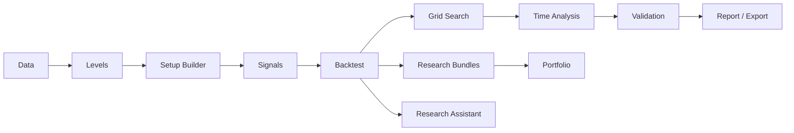

# ARCHITECTURE

Lean documentation index: [`README.md`](README.md) (living vs contract vs
`archive/` / `research/`).

## Packaging and tooling boundary (R9)

| Artifact | Packaged? | Notes |
|---|---|---|
| `thesistester/**` | Yes | The library. `pip install -e .` makes it importable outside Streamlit (`pyproject.toml`, `[tool.setuptools.packages.find] include = ["thesistester*"]`). |
| `app.py`, `pages/**` | No | Streamlit entry points; run from a repo checkout. |
| `tests/**` | No | Runs from the checkout; `testpaths = ["tests"]`. |

Consequence that matters for later milestones: `thesistester/app_state.py` is currently the
only library module that imports `streamlit` at module scope — data, levels, engine,
analytics, persistence, reporting, and visualization modules are Streamlit-free. That is what
makes the R18 headless facade a pure addition rather than a refactor. `streamlit`
nevertheless remains a hard dependency in `pyproject.toml` (mirroring `requirements.txt`);
R18 keeps it there to avoid changing the established install contract. Dependency ranges carry next-major
caps, and `requirements.txt` stays the app-install path.

Tool configuration is centralized in `pyproject.toml` (`ruff`, `pytest`, `coverage`).
CI jobs and the golden-master regeneration guard are defined in `.github/workflows/ci.yml`;
the golden fixture contract lives in `tests/fixtures/golden/README.md`.

Streamlit server limits live in checkout-local `.streamlit/config.toml` (not
packaged): `server.maxUploadSize = 350` (file uploader, MB) and
`server.maxMessageSize = 400` (websocket/protobuf payload, MB; upstream default
200). `MessageSizeError` is that transport cap — independent of host RAM and of
the R18/CLI path, which never serializes frames to the browser. Restart the
Streamlit process after changing either value.

R9 introduced **no** `st.session_state` keys and no engine/analytics behavior change, so the
contract table below is unchanged by it.

## Headless composition boundary (R18)

`thesistester/api.py` is an additional consumer of the same pure functions used
by the Streamlit pages. Its public path is `load_dataset → compute_levels →
build_setup → generate_signals → run_backtest → run_grid → run_validation`;
handoffs are typed `DataFrame`/`dict` values. It owns orchestration only: the
level, signal, OTF, simulation, grid, and validation implementations are
unchanged.

`thesistester/cli.py` validates experiment schema version 1, calls the facade,
and sends its bundle-ready mapping to `build_research_bundle()`.
`thesistester/__main__.py` supplies `python -m thesistester run ...`. Spawned
`ProcessPoolExecutor` workers isolate independent runs; no worker introduces
parallelism inside a single engine pipeline. Results are collected in YAML
order and summarized in `results_index.csv`.

## Research Study Runner boundary (RS1–RS5 + RS-D7/RS6/RS-D2/RS-D8/RS-D9)

`thesistester/study/` is an additive headless module for closed factorial
StudySpecs. RS1 validates; RS2 expands to R18 `experiment.yaml` + factor map;
RS3 wires `python -m thesistester study expand|run` and a **study-owned**
execute loop (`run_experiment` + `build_research_bundle`) with per-cell ledger,
soft resume, and continue-on-failure; RS4 adds `study report` (overview CSV/MD,
OTF Δ, honesty; PF from bundle `trade_summary` unless present on the index);
RS5 adds `study promote` (draft `explicit_cells` survivors; no auto-run) plus
stage-first examples under `examples/studies/`. RS-D7 adds additive index
`profit_factor` / `win_rate`; RS6 adds default-off `STUDY.*` assistant
capabilities. **RS-D2** adds a **read-only** Streamlit Studies viewer
(`pages/15_Studies.py`) over completed study artifacts via
`report_study(..., write_artifacts=False)` /
ledger loaders — no in-app expand/run/promote and no classic research
`st.session_state` mutation. Inspect renders ledger progress
(`ok+failed+skipped / run_count` + running cell names) from the cached
viewer model; Refresh still reloads. A missing `results_index.csv` file with a
readable ledger is ledger-only (no ranked overview); a present but
unreadable/invalid index still errors. Not a job queue. **RS-D8** extends that same page with a
**preview-only** StudySpec pane (`thesistester/study/preview.py`: validate +
in-memory `expand_study`, cap 2_000; no `study.execute` import). **RS-D9**
spawns the existing CLI `study run` from that pane
(`thesistester/study/launch.py`; detached `Popen`; pin both dataset path keys;
confirm bound to the **pinned** identity hash; Windows omits `DETACHED_PROCESS`
so `study.launch.log` inherits stdout; no in-process `run_study`).
**SB2–SB3** add a third **Build StudySpec** tab on the same page
(`thesistester/study/builder.py` emit / hydrate / stage / report; live strip
calls `preview_study_spec`; Apply / hydrate / download stay Studies-scoped).
Build always writes `dataset.format_profile` from the R17 allow-list
(`FORMAT_PROFILE_LABELS`; omitted / blank → `canonical`; unknown
non-blank tokens fail emit). Ingest tokens are page-local
(`INGESTION_MODE_PRIMARY`, `_study_builder_ingestion_mode`) so a stale
builder cannot ImportError the page. Seed/Apply use getattr/hasattr and
`dataset_extra` when `StudyDraft.ingestion_mode` is missing.
Studies-scoped keys only:
`studies_builder_draft` and `studies_builder_pending_sync` (plus
`_study_builder_*` widget keys, including `_study_builder_ingestion_mode`).
The Build tab body executes before Preview
so Apply can write `studies_preview_yaml` (and reseed the launch output-dir
widget) before those widgets instantiate. Build does not write classic
research `st.session_state` keys and does not spawn CLI.
SIA: new drafts and the pdPOC teaching example emit
`dataset.ingestion_mode: 15s_primary_derive_1m`. Execute is unchanged
(`expand` → `run_experiment`). Omitted mode remains `primary`. Studies does
not walk the Data page; parity is the RunSpec contract.
`thesistester.study.execute` imports on Windows: exclusive `.study.lock` uses
POSIX `fcntl.flock` or Windows `msvcrt.locking`
(fail-closed; released on process exit). Study execution sets
`execution_origin="study"`
(member of `EXECUTION_ORIGINS`) and does **not** call `run_batch` — R18 CLI
`run` / `run_batch` all-or-nothing write semantics stay identical. Engine and
classic research pages remain undisturbed. Operator contract:
`docs/STUDY_RUNNER.md`; plan: `docs/STUDY_RUNNER_IMPLEMENTATION_PLAN.md`.
**SV1 + SV2** (Study Viewer catalog + quality panes,
`docs/STUDY_VIEWER_IMPLEMENTATION_PLAN.md`) add Inspect local-study listing +
click-to-load, additive CLI `study list`, and read-only failed-cell / group /
rollup-if-present / launch-log panes on this same page. They keep
`report_study(..., write_artifacts=False)`, must not call `rollup_study()`
(writes), must not hydrate classic research `st.session_state` keys, and must
not deep-link Research Bundles. Discover does not call `report_study`.
`viewer.py` must not import `cli_study`, `thesistester.cli`, or `execute`
(`cli_study` may import `viewer`). Studies-scoped keys:
`studies_catalog_entries`, `studies_catalog_roots_key`,
`studies_viewer_pending_path`, `studies_viewer_catalog_select`.
`studies_viewer_selected_run` is SV4. Do not implement SV3–SV4 inside an
RS/SB/SIA edit.

## Classic/Assistant research identity boundary (CAI-1)

`thesistester/research_identity.py` is the Streamlit-free source of truth for:

- `normalize_levels_config(config, *, instrument)` — product defaults, instrument
  binding (inbound `instrument` keys are ignored; the parameter wins),
  unknown-key rejection, and sorted unordered list fields; and
- frozen `DataIdentity` / `LevelsIdentity` / `ExperimentIdentity` constructors
  used by the headless API, CLI, classic page state, and bundle restore.

`api.compute_levels` calls the shared normalizer. `run_experiment` stamps
additive state fields `data_identity`, `levels_identity`,
`experiment_identity`, and `execution_origin` (keyword-only origin; default
`api`; CLI/Assistant pass `cli` / `assistant`).

Research bundles may include optional `research_identity.json` with
`data_identity` and `levels_identity`. Pre-CAI-1 bundles omit it and restore
without those keys. When only `levels_identity` is present, its nested
`data_identity` is promoted to the top level on write and load.
`execution_origin` is run provenance and is excluded from the identity member
so it cannot change canonical bundle hashes. `experiment_identity` remains on
run state/provenance until path-canonical RunSpec hashing is introduced. No
production cache lookup is performed in CAI-1.

Managed research restore keys include `data_identity`, `levels_identity`,
`format_profile`, `experiment_identity`, and `execution_origin` (the latter two
are cleared on import and not restored from the identity member).
`format_profile` is written to `dataset_meta.json` only when present (so legacy
/ golden projections stay hash-stable); when an older bundle omits it there,
restore falls back to `data_identity.format_profile`.

## Classic/Assistant execution-artifact store (CAI-2)

`thesistester/persistence/execution_artifacts.py` owns an **internal**
content-addressed artifact namespace under
`{store}/execution_artifacts/v1/`. It is distinct from user-facing
`datasets/` and `levels/` snapshot trees.

| Path | Contents |
|---|---|
| `execution_artifacts/v1/data/<data_key>/` | `data.parquet`, `identity.json`, `ingestion_meta.json`, `manifest.json` |
| `execution_artifacts/v1/levels/<levels_key>/` | `levels.parquet`, `session_levels.parquet`, `levels_settings.json`, `identity.json`, `manifest.json` |
| `execution_artifacts/v1/source_index/<binding_key>.json` | Source-bytes → data-artifact binding (CAI-3 warm CSV skip) |
| `execution_artifacts/v1/locks/` | Per-identity exclusive lock files |

Keys derive from `DataIdentity` / `LevelsIdentity` (data keys include
`format_profile` for cache correctness). Writes use temp-dir + fsync + atomic
rename under `fcntl` locks; concurrent writers reuse a verified completed
artifact. File `fsync` uses `O_RDWR` on Windows (`FlushFileBuffers` rejects
read-only handles with `EBADF`); remaining fsync/close OS errors are skipped. `read_verified_*` returns `ArtifactMiss` for missing, corrupt
(including non-numeric schema/engine version fields),
incomplete, schema-drift, engine-incompatible, or path-escape cases and never
raises those conditions into a cold compute path.

### Artifact operations and retention (CAI-10)

Internal execution artifacts are operable without exposing user-owned research
assets to automatic deletion:

| API | Role |
|---|---|
| `list_execution_artifacts` / `get_execution_cache_stats` | Inspection: identity, size, age, producer, schema/engine, hit/miss (`limit=None` for unbounded eviction scans) |
| `delete_execution_artifact` | Safe single-key delete → next read is a cold miss |
| `evict_execution_artifacts` | Full-store LRU/age/bytes eviction under `execution_artifacts/v1` only (`max_age` ages from `accessed_at`) |
| `rebind_source_path` | Relocate a source CSV only after `DataIdentity` content verification |

Store-level hit/miss counters increment on verified data/levels artifact reads
only (source-binding lookups do not double-count a warm data hit).

Protected namespaces (never auto-deleted): `datasets/`, `levels/`, `signals/`,
`setups/`, `assistant/`. Completed research bundles independently contain
dataset/levels/signals/backtest frames, so cache eviction cannot break
hash-verified restore/explain of retained runs. Disk growth is therefore
bounded by eviction policy on the internal cache while user snapshots and
thesis history remain explicit-action-only.

Cache invalidation semantics: delete/evict remove store entries only; the next
`read_write` pipeline miss recomputes cold and may republish. Stale or corrupt
artifacts already fail closed as `ArtifactMiss` (CAI-2).

Cold vs warm performance is characterized by
`tests/benchmarks/cai_cold_path.py` and `tests/benchmarks/cai_warm_path.py`
(informational). A second signal-artifact cache layer stays deferred until warm
`generate_signals` share is measured after levels-cache hits
(`docs/CAI_BASELINE.md`).

Assistant capabilities: `CACHE.inspect_artifacts`, `CACHE.delete_artifact`,
`CACHE.evict_artifacts`, `CACHE.rebind_source_path`.

### Cached headless reuse (CAI-3)

`run_experiment` / `compute_levels` accept keyword-only `cache_policy`
(`off` default, `read`, `read_write`) and optional `store_root`.
CLI and Assistant opt into `read_write`.

Warm data reuse resolves
`execution_artifacts/v1/source_index/<binding_key>.json` from
`(source file SHA-256, instrument, source/exchange timezone, format_profile,
ingestion_mode, derivation_policy)`,
then `read_verified_data_artifact`. Legacy primary runs use
`ingestion_mode="primary"` with `derivation_policy=null`;
`15s_primary_derive_1m` bindings carry
`derivation_policy=observed_aligned_15s_to_1m_v2` so the same source bytes
cannot warm-cross across contracts. Warm levels reuse
`read_verified_levels_artifact` for the normalized `LevelsIdentity`.
Misses (corrupt, incomplete, schema/engine drift, stale source, settings
change) fall through to cold load/compute and, under `read_write`, republish.
Derive-mode warm hits still re-read the 15-second source CSV for R12
`subtimeframe_data`; they do not skip the lower-frame file.

Run state and Assistant provenance expose `cache_provenance`
(`outcome`: `bypassed|cold|data_hit|levels_hit`). Confirmed Assistant runs
persist it on the thesis run record so provenance cards can show cold vs warm
outcomes. It is a managed session/provenance key cleared on bundle import and
is **not** written into hashed bundle members, so cold and warm runs keep equal
canonical bundle hashes. Classic Streamlit session DataFrames are never a cache
source.

## Classic → RunSpec export boundary (CAI-4)

`thesistester/classic_export.py` is a Streamlit-free exporter from canonical
classic page state to a public RunSpec draft:

- `classic_state_export_gaps(state, ..., include_grid=..., include_validation=...,
  include_walk_forward=...)` — structured blocking clarifications (same optional
  section flags as export)
- `classic_state_to_run_spec(state, *, name, source_path=..., store_root=...,
  include_grid=..., include_validation=..., include_walk_forward=...)`
  — validated RunSpec or `ValueError` when gaps remain

It reads only page-produced mappings/frames (`data`, provenance,
`levels_settings`, `setup_config` / `last_signal_setup`, backtest policy
snapshots or `backtest_config`). A stored `data_identity` alone is not enough —
the canonical in-memory `data` frame is required so fingerprint/stale checks
can run. Non-integer `levels_data_fingerprint.rows` yields a `stale_levels`
gap instead of crashing. When assembling backtest without `backtest_config`, live Backtest
widget keys win over post-run policy snapshots. Disabled session-flat clears
timezone/cutoff for both assembled and explicit `backtest_config` paths,
matching the Backtest page. Unpaired or invalid exit-management trailing/BE
fields are `incomplete_exit_management` gaps (not deferred to
`validate_run_spec`). Missing parameters are never invented.
Source strategy: prefer a verified execution data artifact
(`dataset.data_artifact_key`); always require an explicit CSV path
(`source_path` / `dataset_source_path` / `source_csv_path`) verified against
classic `DataIdentity`; blank/whitespace `source_path` kwargs fall through to
state path keys. Corrupt/incomplete preferred artifacts are omitted and
export falls back to the verified CSV path rather than blocking. CAI-4 does not
wire UI buttons or thesis attachment (those land in CAI-5/CAI-6).

## Classic thesis research context (CAI-5)

`thesistester/classic_context.py` owns additive classic research-mode session
keys and chrome. Helpers are Streamlit-free; `render_classic_thesis_chrome`
imports Streamlit lazily for Setup Builder / Signals / Backtest / Research
Bundles only.

| Key | Role |
|---|---|
| `classic_active_thesis_id` | Active thesis in classic research mode |
| `classic_active_thesis_name` | Cached display name for the breadcrumb |
| `classic_recording_policy` | `manual` (default) or `all_executions` (CAI-7 ledger); chrome selectbox |
| `classic_pending_navigation` | Optional one-shot allowlisted page target (`st.switch_page`) |
| `classic_bound_dataset_id` | Dataset identity that must match or context clears; unset binds on first observed `dataset_id` |
| `classic_flash` | One-shot `{level, message}` UI notice |
| `classic_active_run_id` | Thesis-scoped run breadcrumb after record/discuss/open-exact (CAI-8) |
| `classic_focus_run_id` | One-shot Assistant focus staged by Discuss this run (CAI-8); always a run-id **string**, never a dict |
| `classic_focus_channel` | RQ-4 companion to focus run; sole legal non-null value `"results_qa"` (`None`/absent = legacy banner-only) |
| `classic_nav_prefill` | One-shot `{target_page, note}` clarification caption (CAI-8; no page mutation) |
| `classic_page_proposal` | Staged classic draft `{thesis_id, target_page, draft_patch, note, evidence_paths}` (CAI-9; Apply on owning page only) |

`link_thesis` syncs `assistant_selected_thesis_id` via `select_thesis` and does
**not** record a run or mutate executable classic producer keys. Create/link UI
lives on Setup Builder; other classic pages show breadcrumb + exit/relink only.
Exit and dataset-switch clears also reset `_classic_relink_open_*` UI flags so
the relink form does not reopen after re-entry. Research Bundles import
re-syncs classic context against the imported `dataset_id` before rerun.
Thesis prose remains Assistant-owned; executable settings remain page-owned.

## Classic → thesis run registration (CAI-6)

`AssistantOrchestrator.register_external_bundle_run(...)` attaches a verified
research bundle as a completed thesis run without recomputing:

- Capability: `BUNDLE.register_external_run` (`import_export`,
  `explicit_confirmation`). The handler verifies only; persistence is owned by
  the orchestrator façade.
- Verification: path containment under assistant data roots, canonical bundle
  hash, required sections `dataset` / `levels` / `signals` / `backtest`, and
  compatibility with a CAI-4 exported RunSpec.
- Lifecycle: confirm RunSpec → `start_run` → `complete_run` with
  `provenance.execution_origin="classic"`. Same hash reuses a completed run
  whose stored provenance `bundle_path` remains readable/hash-valid and whose
  stored RunSpec still matches (stale/drifted matches are skipped); reuse
  reports stored `execution_origin`. Classic session recording preflights
  required bundle sections, honors `store_root`, and removes orphan UUID zips
  on failure or idempotent reuse while retaining cancelled-run provenance
  bundles.
- UI helper: `thesistester/classic_record.py` (`record_classic_session_run`,
  `render_record_and_discuss`) on Backtest and Research Bundles. When classic
  pages omit a source CSV path, a lineage OHLCV CSV is materialized under the
  thesis store for RunSpec `dataset.path` only — levels/trades are never
  recomputed. Materialized lineage files are always comma-separated canonical
  OHLCV, so export/verification forces `dataset.format_profile="canonical"`
  even when the session still carries a vendor ingest profile (e.g. Quantower
  History Exporter semicolon). The export overlay also coerces timestamp
  units to whatever dtype the materialized lineage CSV reloads as (pandas 2
  `ns` vs pandas 3 `us`) so 15s→1m derived parents round-trip to the same
  `DataIdentity` hash as path verification.
  That overlay is export-only: research-bundle `dataset_meta` and CAI-8
  provenance `data_identity.format_profile` keep the ingest profile so page
  badges stay exact while RunSpec re-exec uses the lineage parser. Recording
  stays out of `classic_context.py`.

After registration, `explain_run` / `compare_completed_runs` /
`restore_run_bundle_to_session` work from the verified bundle like any other
completed run. Future recomputation still requires
`execute_confirmed_run` on a confirmed specification.

## Classic ↔ Assistant navigation and identity badges (CAI-8)

`thesistester/classic_nav.py` owns bidirectional navigation without duplicating
pages:

- **Discuss this run** (Backtest / Research Bundles): sets active + focus run
  (`classic_focus_run_id`, still a run-id string) and navigates to Research
  Assistant; does not re-register. Visible under research mode even without
  live session trades (uses thesis-recorded runs). Only completed runs with
  hash-verified bundle provenance are discussable; non-discussable active
  breadcrumbs fall back to latest discussable. RQ-4 (see
  `RESULTS_AND_PRODUCT_QA_IMPLEMENTATION.md`) adds companion session key
  `classic_focus_channel` with sole legal non-null value `"results_qa"` so
  Assistant preselects mode **Discuss runs** and that run’s **Discuss results**
  thread; it must not convert `classic_focus_run_id` into a dict or invent any
  other focus-key namespace. Both focus keys clear together on consume and on
  thesis-scoped classic clear. After consume, `assistant_results_qa_deep_link`
  + `assistant_focused_run_id` keep the Discuss preselect sticky and also keep
  Advanced/Linked research-run expanders open across reruns until thesis switch
  (diagnostics side effect — Discuss Q&A itself is in **Discuss runs**, not
  under Advanced); a one-shot `assistant_results_qa_force_expand` reopens keyed
  expanders if Advanced was previously collapsed.
  `align_assistant_thesis_for_discuss` (Discuss + Record and discuss) syncs
  thesis/`assistant_thesis_picker`; Assistant also prefers
  `classic_active_thesis_id` when focus is still staged.
- **Open exact / Restore bundle** (Assistant): hash-verified
  `restore_run_bundle_to_session` clears staged `classic_page_proposal`
  (restored widgets must not be overwritten by a prior draft). Open exact
  also re-links thesis, sets active run, and navigates to Backtest.
- **Clarification → classic page**: allowlisted `st.switch_page` plus
  `classic_nav_prefill` caption only — never auto-mutates page widgets and
  does not stage `classic_pending_navigation` (Data/Levels have no chrome
  consumer). Backtest shows the prefill before signals/trades `st.stop()`.
- Identity badges use relation codes `exact_match` /
  `same_data_different_levels` / `different_data` / `identity_unavailable`
  from immutable `DataIdentity` / `LevelsIdentity` (provenance or
  `peek_research_identity`; full bundle load deferred until open/explain/
  restore/compare).
- Thesis switch / exit / dataset switch clears run breadcrumb, focus, and
  prefill; cross-thesis run selection fails closed.

## Evidence-backed page capabilities (CAI-9)

`thesistester/assistant/page_summaries.py` projects hash-verified research
bundles into bounded JSON summaries (configuration/identity/families/columns,
signal distributions, backtest KPIs/costs/intrabar caveats, grid selection,
validation/OOS scalars). Registry capabilities
`LEVELS.inspect_and_chart`, `SIGNALS.inspect_and_chart`,
`BACKTEST.inspect_results`, `GRID.inspect_results`, and
`VALIDATION.inspect_results` are `inspect_only` with typed handlers; charts
remain classic-page owned.

`build_evidence_packet` embeds the same page summaries under
`results.levels_summary` / `signals_summary` / `backtest_page_summary` /
`grid_summary` / `validation_page_summary` so inspect payloads and explanation
templates share claim paths. Backtest inspect passes run provenance so cost
caveats match evidence assumptions.

Controlled proposals use `CLASSIC.propose_page_change` and
`thesistester/classic_proposal.py`: validate → stage into
`classic_page_proposal` (thesis-scoped) → user Apply on Setup Builder or
Backtest. Staging does not mutate widgets; Apply/get fail closed when the
active thesis does not match the staged `thesis_id`; a real thesis switch
clears the proposal unless the new thesis matches the proposal's
`thesis_id` (same-thesis re-link / return-to-proposing-thesis). Backtest
SL/TP proposal fields require `>= 1` to match page widgets. Page summaries are recursively
DataFrame-free and key-canonicalized; backtest `zero_costs` caveats follow
evidence-packet cost assumptions (explicit zeros only). Research bundles
persist `backtest_execution_costs` / exposure for hash-verified inspect.
Apply/stage helpers stay out of `classic_context`.

## Classic research-mode execution ledger (CAI-7)

`thesistester/classic_ledger.py` implements opt-in `all_executions` attempt
history under an active thesis:

- Gating: `should_record_all_executions` — research mode **and**
  `classic_recording_policy == "all_executions"`. Manual policy or no thesis
  leaves the classic Backtest path unchanged.
- Before OTF/simulate: `begin_classic_execution_ledger` exports a CAI-4 RunSpec
  (materializing a lineage CSV when needed), confirms it, and `start_run` with
  `request.action="classic_execution_ledger"`, `origin_page`, and
  `classic_config_hash`.
- On any post-begin Backtest failure (OTF/simulate/`ValueError` or other
  exceptions during session persist/complete): `fail_classic_execution_ledger`
  → status `failed` (never left `running`, never `completed` on failure).
- After successful session writes: `complete_classic_execution_ledger` builds a
  research bundle and `complete_run` with `execution_origin="classic"`. A
  bundle-write or `complete_run` failure fails the run while retaining the
  original request (orphan zip removed).
- Recording-policy selectbox uses a shared Streamlit widget key synced from
  session policy so a stale per-page widget cannot silently revert policy.
- Surfaces: Backtest ledger table; Assistant Research runs labels
  (`ledger:backtest` / `recorded:manual` / `assistant`);
  `build_provenance_card` includes origin/config/policy/execution_origin.
- Ledger APIs stay out of `classic_context.py` so link/create remain
  non-recording.

## AI Research Assistant contract boundary (AIA-0)

`thesistester.assistant` is a Streamlit-free metadata boundary for the proposed
single-user AI Research Assistant. It currently defines versioned, JSON-safe
contracts, a feature-parity registry, and an additive local thesis repository.
It does not execute research, import Streamlit, or alter engine/analytics
behavior.

The registry records every user-visible product area as `executable`,
`inspect_only`, `import_export`, or `unsupported`, with its public symbol,
confirmation requirement, resource envelope, and any documented limitation.
Future assistant tools must validate an `AssistantRequest` against this registry
before execution and may only call declared public headless interfaces.
Undeclared and unsupported capability requests fail closed.

This boundary adds no `st.session_state` keys. A future assistant page must use
additive, namespaced keys and document them here in the same PR.

The Research Assistant page stages only these additive `assistant_*` keys
(source of truth: `ASSISTANT_SESSION_KEYS` in
`thesistester/assistant/workspace.py`):

| Key | Role |
|---|---|
| `assistant_selected_thesis_id` | Active thesis |
| `assistant_draft_prompt` | Staged prose prompt |
| `assistant_draft_choices` | Staged structured RunSpec sections |
| `assistant_conversation_ids` | `{thesis_id: conversation_id}` map |
| `assistant_hydrated_conversation_id` | Conversation hydration guard |
| `assistant_validated_run_spec` | `{choices, spec}` after validate |
| `assistant_run_explanations` | Deterministic explain cache by run_id |
| `assistant_llm_run_explanations` | Evidence-only LLM explain cache (cleared on failed regen) |
| `assistant_llm_attempts` | Provider attempt counts by run_id (cleared with failed regen) |
| `assistant_run_reports` | Markdown report cache by run_id |
| `assistant_run_artifacts` | Research artifact cache by run_id |
| `assistant_run_comparisons` | In-session comparison by thesis_id |
| `assistant_portfolio_analyses` | In-session portfolio analysis by thesis_id |
| `assistant_focused_run_id` | Last classic-focused run id (RQ-4 deep-link / banner) |
| `assistant_results_qa_deep_link` | Sticky `results_qa` deep-link: Discuss runs mode + run preselect (also keeps Advanced/Linked research-run expanders open) |
| `assistant_results_qa_force_expand` | One-shot force-open for keyed Advanced/Linked research-run expanders |
| `assistant_bundle_handoff` | Last hash-verified restore into research pages |
| `assistant_flash` | One-shot `{level, message}` UI notice consumed after `st.rerun()` |
| `assistant_voice_results_sessions` | `{run_id: voice_session_id}` map for last Discuss PTT session |
| `assistant_voice_help_session_id` | Last Help PTT `voice_session_id` |
| `assistant_voice_last_turn` | Last PTT public diagnostics (`stt_text`, path, grounding, …) |
| `assistant_voice_playback` | Ephemeral last TTS `{mime, bytes, channel, session_id}` for `st.audio` (not durable `store_audio`) |
| `assistant_ux_mode` | RUX-1 mode preselection (`discuss` \| `help` \| `draft`); doubles as the mode-selector widget key |
| `assistant_discuss_run_picker` | RUX-1 Discuss-mode run-id selectbox value (`str \| None`); doubles as the picker widget key |

`[assistant.ux]` in `config/assistant.toml` holds `default_mode` (default
`"discuss"`). `load_assistant_ux_settings()` in
`thesistester/assistant/llm.py` returns that value; missing section or unknown
mode → `"discuss"`. Navigation fragments for page / Help remediation captions
live in `thesistester/assistant/ux.py` (`DISCUSS_NAV_HINT`, `DISCUSS_NAV_SHORT`,
`HELP_NAV_HINT`, `ADVANCED_*_NAV_HINT`) — see
`docs/RESEARCH_ASSISTANT_UX_REFOCUS_PLAN.md` §1.3.

Realtime voice review (VA-series; post-RQ / post-HC) must add only namespaced
`assistant_voice_*` keys in the same PR that introduces them; see
`docs/REALTIME_VOICE_AGENT_IMPLEMENTATION.md`. Voice is a spoken transport over
shipped Discuss/Help channels, not a parallel reply stack. **VA-0 landed:**
`config/assistant.toml` reserves `[assistant.voice]` (`enabled = false`);
schema-versioned contracts + `load_voice_settings()` under
`thesistester/assistant/voice/`. **VA-2 landed:** `voice/xai_realtime.py`
(server-side `XAI_API_KEY` resolution, ephemeral token mint, unary STT/TTS) and
`VoiceSessionService` persisting sibling
`assistant/theses/{thesis_id}/voice_sessions/vs_[0-9a-f]{32}.json` via
`LocalThesisRepository` (does not widen `Conversation` or reuse `_ID_RE`).
Results sessions bind one hash-verified `EvidencePacket`; Help sessions omit
run/hash. **VA-3 landed:** read-only voice tools + `audit_spoken_text`.
**VA-4 landed:** push-to-talk mic UI (Discuss results + Help) calling
`handle_voice_ptt_turn` → RQ handlers (OpenAI) with VA-3 tool fallback;
`assistant_voice_*` keys above; mic blocked while any thesis run is
`status=="running"`. **VA-5 landed:** localhost realtime sidecar
(`voice/sidecar.py`, bind `127.0.0.1` only) with VA-3 function-tool bridge;
Research Assistant registers sessions via `POST /v1/sessions` when
`assistant.voice.mode = "realtime"` and opens the sidecar `/client` page.
Ephemeral page staging for realtime includes `assistant_voice_sidecar_host` /
`assistant_voice_sidecar_port` and `assistant_voice_realtime_{run_id}` (not
durable thesis keys). Default remains `enabled=false`.

Multi-turn results discussion and product help (RQ-series) add only documented
additive `assistant_*` keys and conversation message tags
(`channel` ∈ {`results_qa`, `product_help`}, plus `run_id` for results); see
`docs/RESULTS_AND_PRODUCT_QA_IMPLEMENTATION.md`. Contract freezes for that
series include: draft history isolation (`handle_chat_turn` / draft hydration /
thesis chat display ignore `channel`-tagged messages), Discuss/Help inputs as a
single **page-level** mode-scoped `st.chat_input` (RUX-3; never nested; never a
second page-level input), frozen Help §7.1
path+section allowlist (no `AGENT_GUIDE`; no agent-invented sections), Help
numeric grounding via verbatim corpus/registry substrings, and RQ-4 companion
key `classic_focus_channel="results_qa"` beside string `classic_focus_run_id`
(not a dict focus payload). **RQ-0 landed:** `config/assistant.toml` reserves
`[assistant.results_qa]` / `[assistant.product_help]`; loaders live in
`thesistester/assistant/llm.py`; inert corpus allowlist/loaders live in
`thesistester/assistant/help_corpus.py`. **RQ-1 landed:**
`thesistester/assistant/results_qa.py` + `handle_results_turn`; Discuss results
UI in the **Discuss runs** mode (RUX-2/RUX-3 page-level chat_input).
**RQ-2 landed:** `thesistester/assistant/results_projections.py` builds
ephemeral `results.projections.grid_rankings.*` /
`results.projections.time_rankings.*` for each Discuss turn (never persisted
into bundles). Ranking metric defaults from allowlisted aggregate/directional
`results.best_grid_result.ranking_metric` else allowlisted
`assumptions.grid.ranking_metric` else `expectancy_r` (unknown names fall
through). Optional `assumptions.grid.min_long_trades` /
`min_short_trades` filter directional re-ranks when present. JSON-null
profit-factor on all-wins rows ranks as +inf; when re-rank still disagrees,
packet `best_grid_result` is pinned as projection `best`. Empty bundle
`tables.grid_results` falls back to packet `best_grid_result` so
“best SL/TP” remains answerable when no grid table was exported. Time
rankings prefer `entry_rth_segment` when it has a usable label, else fall
back to `entry_30min_bucket` / `entry_hour_bucket` so Time Analysis
clock-bucket exports still yield a non-null `best.bucket`. Cited `HH:MM`
bucket labels ground matching clock spans as wholes without allowlisting
component digits (hash/path strings do not launder digits). **PR 5d landed:**
bounded `results.projections.confluence_combo` is recomputed on-demand from
loaded trade rows (same mode/anchor path as report/bundle export; 5c siblings
optional) with a frozen discuss allowlist — fail closed when unavailable; no
full `by_*` dumps or Setup auto-recommendations. Results Q&A
strips stacked accidental `evidence_packet.` / `packet.` claim-path prefixes
and resolves JSON array indices; fractional rates accept `%` (incl. spaced
`60 %`) or word-form percent narration (`percent` / `pct` / `Prozent`), and
European decimal commas (`0,25` ↔ `0.25`) as whole tokens (thousands groups
like `25,000` are not decimals; clock minutes cannot become synthetic percent
tokens).
Optional RO `TIME.analyze` enrichment runs only when
`assistant.results_qa.allow_time_enrichment=true` (default `false`) and
`time_grouped_summary` is missing, after hash verification.
**DI-1 landed:** Discuss recovery knobs
`assistant.results_qa.repair_retry_enabled` (default `true`) and
`assistant.results_qa.deterministic_overview_fallback` (default `true`)
change recovery UX while leaving the RQ digit/path auditor unchanged.
`UrllibOpenAITransport` wraps only the TLS allowlist (`ssl.SSLError` /
`ssl.CertificateError` / `URLError` with those reasons) into retryable
`LLMProviderError`. Overview cue matching + negative-cue veto and
deterministic KPI fallback live in
`thesistester/assistant/results_overview.py` and are applied inside
`propose_results_reply` / `handle_results_turn` (not page-only). Flags both
`false` restore pre-DI grounding hard-fail (TLS wrap remains).
**RI-1 landed:** `assistant.results_qa.deterministic_specialist_fallback`
(default `true`) enables deterministic `grid_ranking` recovery after LLM/
repair faults when grid evidence exists. Unified `match_discuss_intent`
multi-eval + §4.1.1 residual DI veto (grid cues sunsets; other DI negatives
remain residual) redefine `has_overview_negative_cue` without a voice cue
fork. Missing-grid and mixed-ask turns short-circuit before any LLM call.
Flags-off restores pre-RI specialist remediation/hard-fail while overview DI
flags stay independent.
**RI-3 landed:** deterministic `validation_wfa` recovery over frozen
walk-forward / bootstrap / grid-overfit leaves; validation/WFA/OOS/bootstrap
cues sunset from residual; missing-validation short-circuit before LLM; never
cites `results.trade_summary.*` as OOS proof; OOS anti-soften still gates
deterministic replies.
**RI-2 landed:** deterministic `time_ranking` recovery over frozen
`results.projections.time_rankings.*` (§4.3); time/hour/bucket/clock/session
segment cues sunset from residual; missing-time short-circuit before LLM; may
project from `results.time_grouped_summary` when the ephemeral projection is
absent or incomplete (no TIME.analyze enablement), syncing the projection into
the turn `evidence_packet` before catalog/LLM/path audit; integer hour buckets
coerce to `HH:00`; no invented clocks.
**RI-4 landed:** deterministic `single_metric` recovery over the frozen §4.5
noun→`results.trade_summary.*` map; value collocates required (`how many` only
via explicit `how many trades`); hard-refuse when grid/time/validation/residual
collocates are present (never cite IS expectancy for OOS asks); `over time`
idioms do not fire bare time; bare time×metric → `mixed_ask`; missing-leaf
short-circuit before LLM; win-rate `%` narration.
**RI-7 landed:** extends DI-3 `build_expert_overlay` / `apply_expert_overlay`
(alias `build_meaning_overlay`) with specialist + single-metric path glosses;
intent-aware next-step coaching; missing-OOS honesty line when packet signals
absence; wire order claims→mandatory caveats→overlay→auditor for overview and
landed specialist / single-metric replies; overlay lines stay
`_ungrounded_number_tokens(..., allowed=set()) == []`.
**RI-8 landed:** `mixed_ask` → `compose_deterministic_replies` (§4.7):
priority-ordered per-intent deterministic slices (no per-slice overlay),
concatenated summaries, path-deduped claims, merged/deduped caveats, one RI-7
overlay + auditor once; compose ≤3 **raw** intents (>3 or missing slice →
narrow remediation; dual overview collapses after the cap).
**RI-5 landed:** deterministic `robustness_tier2` recovery over the frozen §4.6
presence-first path table (Monte Carlo / overfitting / sensitivity / noise /
portfolio / OTF); MC + `otf validation` / `otf-validation` cues sunset from
residual; missing-all batteries short-circuit before LLM; catalog
`existing_paths` + decode hard-reject undeclared nested dumps / KPI
substitutions; never narrates non-bool `.available` as scalars.
**RI-6 landed:** deterministic `assumptions_costs` recovery over the frozen §4.6
costs/exposure/intrabar/focus/instrument/dataset allowlist; missing-all
short-circuit before LLM; catalog + decode hard-reject `trade_summary` KPI
substitutions; configured SL/TP ticks narrate as assumption leaves (not grid
best); how-to/docs false friends stay unmatched; grid×costs compose owns shared
commission/slippage on the assumptions slice.
**RI-9 landed:** deterministic `deep_trade` recovery over capped ephemeral §6
projections (`exit_reason_counts`, `extreme_trades`, `streak_summary`) built
from already-loaded bundle trade tables / trade_summary streaks; exit/extreme
asks require table-derived projections (streak-only cannot answer them);
digit-bearing exit labels are not narratable; extreme timestamps omitted from
the model-facing projection; catalog + decode hard-reject undeclared /
`trade_summary` KPI substitutions; raw trade frames never enter the model path.
**PR 5d landed:** deterministic `confluence_combo` recovery over capped
`results.projections.confluence_combo` (trades recompute; 5c optional); frozen
allowlist + missing short-circuit; digit-bearing combo labels are not narratable;
no full `by_*` dumps / Setup auto-recommendations / edge claims.
**RI-10 landed (series complete):** duplex `get_run_overview` projects
`build_deterministic_discuss_reply` / compose into specialist envelopes
(`summary` + `claims`, no `kpi_claims`); pure overview keeps DI KPI envelopes;
permanent residual cues still veto ≠ unmatched; voice default remains off.
**DI-2 landed:** first-pass Results Q&A user payloads include
`path_catalog.existing_paths` (bounded paths present on the turn context;
KPI + projections/validation + honesty paths reserved before fat time tables
/ provenance). Overview/KPI asks (DI-1 matcher) also receive `kpi_allowlist` /
`preferred_claim_paths`; non-overview asks get the shared catalog only.
Repair retries reuse that catalog (no duplicate `repair.existing_paths` list).
Matcher ownership stays in DI-1; DI-2 does not widen intents.
**DI-3 landed:** overview/KPI replies append a strictly digit-free expert
overlay (`build_expert_overlay` / `apply_expert_overlay` in
`results_overview.py`) after mandatory packet caveats; overlay lines are
audited with `_ungrounded_number_tokens(..., allowed=set())`. Overview
followups use a digit-free bank (packet-aware: suppress WFA-presence coaching
when `missing_oos` / WFA-absent limitations already apply). Empty-KPI overlays
do not say “these figures,” and diagnostic honesty is near-deduped against
`diagnostic_only`. **RI-7** extends the same digit-free overlay to landed
specialist / single-metric replies (intent-aware next-step; OOS-absent coaching
suppressed from caveats **and** followups when packet signals or cited
`oos_status` is missing/failed).
**RQ-3 landed:** `thesistester/assistant/product_help.py` +
`handle_help_turn`; Help / how it works mode on Research Assistant
(page-level mode-scoped `st.chat_input`; RUX-3);
lexical `select_help_corpus_chunks` under §7.1 + registry digest (never
`AGENT_GUIDE`). The Help UI passes package-relative `repo_root` (orchestrator
defaults to the same when omitted — not process cwd). Run-performance
questions (metric nouns / past-tense run asks) remediate to Discuss results;
possessive product/workflow questions (`my grid ranking`, `where are my
results?`, `how does this run get confirmed`) and definition/computation asks
about metric nouns (`How is my expectancy computed?`) stay in Help.
Zero-overlap Help retrieval packs the allowlist prefix (manifest order), not
alphabetical `doc_id`. Help digit grounding uses number-token matching (not
bare substring); the Help system prompt matches that contract. RUX-3 retires
`assistant_results_qa_drafts` / `assistant_product_help_draft` and the
deferred `assistant_clear_*` text-input flags: Discuss/Help/Draft share one
page-level `st.chat_input` (trigger widget; unsent draft text is not persisted
across reruns — intentional UX simplification, not durable store loss). The
widget stays mounted in every mode for layout stability but is `disabled` when
Discuss has no selected run / Results Q&A is off, or Product Help is off.
Thesis chat remains draft-only; deterministic Explain run lives in **Discuss
runs** mode; one-shot LLM explain remains under
`Advanced → Linked research runs` (not the Discuss Q&A surface).

Thesis switches clear `THESIS_SCOPED_STAGING_KEYS` (`assistant_draft_prompt`,
`assistant_draft_choices`, `assistant_hydrated_conversation_id`,
`assistant_validated_run_spec`, `assistant_focused_run_id`,
`assistant_results_qa_deep_link`, `assistant_results_qa_force_expand`,
`assistant_bundle_handoff`, `assistant_flash`,
`assistant_voice_results_sessions`, `assistant_voice_help_session_id`,
`assistant_voice_last_turn`, `assistant_voice_playback`,
`assistant_ux_mode`, `assistant_discuss_run_picker`)
so draft/validation/hydration/handoff/flash/deep-link/voice/UX staging cannot leak.
`clear_thesis_scoped_state` hardcodes each reset (it does **not** iterate the
tuple). For the RUX mode/picker keys it pops the Streamlit widget keys then
rewrites defaults via `reset_ux_mode_and_picker` (`assistant_ux_mode` ←
`load_assistant_ux_settings().default_mode`, picker ← `None`) so a stale
selectbox option cannot survive a thesis switch. It also deletes ephemeral
Streamlit widget keys prefixed `assistant-chat-input-` / `voice-results-audio-` /
`voice-help-audio` / `ra-run-expander-`, plus the Advanced expander key, so
mode-scoped chat widgets and PTT audio cannot leak across theses. Discuss results assistant
`content` embeds path-cited Claims (via `format_results_qa_reply_content`) for
plain-text auditability. `handle_chat_turn` draft history excludes
channel-tagged messages and channel-less `role: tool` audit lines so RO
evidence loads cannot evict thesis user/assistant turns from the trimmed
prompt. The Active handoff caption is
further gated by `active_bundle_handoff()` so a stale handoff never displays for
a different thesis.
Apply/Draft/Validate/Cancel/Confirm/Run and Compare/Portfolio outcome notices
use `set_assistant_flash` / `consume_assistant_flash` so discuss-first hub reruns
(and collapsed Advanced defaults) do not silently drop feedback. Compare and
portfolio also cache results in `assistant_run_comparisons` /
`assistant_portfolio_analyses` so conclusions remain when Advanced is reopened.
Specification list labels use `format_spec_status` /
`spec_status_next_step`; `ready_for_confirmation` means “ready to confirm under
Plan review after Validate”, not “waiting on a button inside the list”.
Versions are created only by Draft research plan and Confirm — Apply controls
stage session draft choices only.
Assistant structured controls use searchable Streamlit `selectbox` /
`multiselect` catalogs (shared `TIMEZONE_OPTIONS`, confluence level catalog via
`build_confluence_level_options()`, VWAP/POC windows, opening-range sizes)
rather than free-text comma lists, matching Setup Builder / Data / Levels UX.
Draft values outside a fixed catalog are appended via `options_with_current()` /
`options_with_currents()` so Apply cannot silently remap unknown timezones,
opening-range minutes, or VWAP/POC windows. Legacy numeric VWAP/POC drafts
(`30`) coerce to Levels labels (`30min`) via `coerce_window_label()`. Explicit
empty VWAP/POC/indicator lists do not expand back into full catalogs.
`assistant_draft_choices` contains only supported structured RunSpec sections;
narrative LLM hints stay in conversation history and never become execution
candidates. Clarification checks trust only structured sections
(`levels.session_vwap_enabled`, `setup.tolerance_ticks`), never legacy flat
keys. Setup controls reject empty confluence-level lists so
`min_confluences`/`max_confluences` cannot claim levels that were not selected.
Enabled walk-forward controls persist explicit `window_mode` and
`overlap_policy` alongside fold sizes (sessions or bars), and canonical
compilation rejects enabled walk-forward blocks that omit those sizing fields
so API train/test defaults cannot be inferred at confirmation. Bundle handoff
restores managed research keys through
`AssistantOrchestrator.restore_run_bundle_to_session()` after hash verification;
it does not bypass existing research-page producers for new compute.

`LocalThesisRepository` stores schema-versioned thesis metadata, immutable
specification versions, requested/terminal run provenance, and append-only
conversations under `.thesistester_store/assistant/`. It writes assistant
documents atomically (temp file → `fsync` → `os.replace`) and fails closed on
corrupt or newer schema records. Directory `fsync` after rename runs only when
`os.O_DIRECTORY` exists (POSIX); Windows skips that step so thesis creation does
not raise after the record is already committed.
It does not read or modify research bundles or existing local-store namespaces.
Confirmation is an atomic compiler boundary: it accepts only a resolved
ready-for-confirmation draft, recompiles the typed structured choices into an
API RunSpec, and calls `validate_run_spec()` before writing an immutable
confirmed child. The orchestrator repeats that validation immediately before
execution. Narrative fields that have no public-pipeline mapping are rejected,
rather than being stored as executable assumptions.

`AssistantOrchestrator.for_local_workspace()` is the Streamlit entrypoint.
`dispatch()` remains the only compute router for registry capabilities. Workspace
façade methods wrap thesis/spec/run/conversation/comparison lifecycle,
validate/confirm, explain/compare/export/portfolio, and bundle handoff so the
Research Assistant page stays presentation-only. Default open surface is
**discuss-first**: active thesis identity, Manage thesis (collapsed), and a mode
selector (`Discuss runs` / `Help` / `Draft thesis`) with Discuss as the default.
Classic Streamlit navigation remains the primary research path; the page does
**not** duplicate an Open-research-pages link strip. Discuss results (run picker
+ thread/input/voice + Explain / Open exact / Restore) and Help / how it works
render as top-level mode bodies. Thesis **Assistant chat** lives under Draft
thesis. Optional Assistant draft → validate → confirm → run, linked runs, and
compare/portfolio live under collapsed `Advanced: draft, runs & compare`.
Compare/portfolio hub-flash outcomes and keep conclusions/summary visible under
Advanced when reopened; only raw result JSON is nested under collapsed `Debug:`
expanders. Raw JSON editors and Conversation audit live under collapsed
`Debug: raw JSON & conversation audit`. Structured execution /
setup controls and Validated executable RunSpec default to `expanded=False`.
Assistant chat is **thesis-drafting only** (`handle_chat_turn` → choices +
clarifications); it never narrates completed runs. Chat bubbles render via
`format_chat_message_body` / `chat_message_display_role` (tool audit lines stay
out of the friendly chat and remain under Debug → Conversation audit). Draft
replies persist readable clarification text in `content` as well as the
structured `clarifications` field. Post-run narratives use Explain run in
**Discuss runs** mode; optional `explain_run_with_llm` stays under
`Advanced → Linked research runs` (LLM explain only — not Discuss Q&A). Plan
review surfaces
clarifications only when the newest specification is still
`needs_clarification` (`latest_unresolved_assumptions()`). Drafting syncs
`normalized_run_spec` back into `assistant_draft_choices`. Numeric widget
defaults use `safe_int`/`safe_float` so malformed JSON/chat values cannot crash
rerenders. Bundle restore clears `assistant_validated_run_spec` and the page
reruns so the Active handoff caption refreshes immediately.
Explanations are packet-backed: `EvidencePacket` is schema-versioned and
includes structured caveats, limitations, claims, and next-experiment guidance.
`explain_evidence_report()` / `assert_claims_grounded()` ensure every displayed
numeric claim cites an evidence path and exact value. When provenance includes
a dataset fingerprint, identity is exposed at both
`assumptions.dataset.dataset_fingerprint` (nested under the dataset object for
LLM claim discoverability) and the sibling `assumptions.dataset_fingerprint`
(kept for `compare_evidence` / older consumers). The nested key is omitted when
provenance has no fingerprint so null identity cannot validate LLM claims.
Optional LLM paraphrase
(`explain_packet_with_llm` / `AssistantOrchestrator.explain_run_with_llm`) is a
separate fail-closed gate: provider JSON must be exactly
`{summary, caveats, claims}` with claim `{text, path}` objects; the server
resolves `path` against the immutable packet, attaches the packet value, and
`assert_llm_explanation_grounded()` rejects any numeric token not present in
cited claim values. Percent-suffixed narration (`50%`) is accepted when the
matching fractional claim value (`0.5`) is cited. Packet caveat message numbers
may be echoed only on LLM caveat lines that actually repeat that packet caveat
— never as a global allowlist for the summary. `merge_mandatory_packet_caveats`
re-appends any omitted packet caveat messages before persist/render; when the
packet carries `missing_oos` / `failed_oos`, OOS/WFA “confirmed/robust”
soften language in summary/claims/followups fails closed. The LLM never
executes tools, mutates confirmed specs, or bypasses confirmation. Without a
provider, deterministic explain/compare/export remains the default path.
`audit_capability_registry()` is the machine-readable release audit over
`FEATURE_PARITY_REGISTRY` × `HANDLER_REGISTRY`. Grid ranking-metric claims
ground to `assumptions.grid.ranking_metric` when `best_grid_result` omits that
field (typical grid row snapshots), and printed commission/slippage values are
claimed at `assumptions.costs_exposure.*`. Failure diagnostics claim
`provenance.error` or `results.error` according to where the message lives.
Top-level research-artifact `otf_validation` is projected into
`results.otf_validation` / `results.otf_validation_summary`, and OTF availability
claims cite `assumptions.otf_filter.available` or validation result paths only.
`intrabar_ambiguity` fires for non-`sl_first` models via
`assumptions.intrabar.intrabar_model` / `costs_exposure.intrabar_model` even when
`backtest_intrabar_diagnostic` is absent.
`compare_evidence()`
returns versioned nested evidence covering metrics, executable-spec diffs,
data comparability, conclusions, and next experiments. Persisted `Comparison`
records are schema v2 (`created_at`, `conclusions`); v1 records migrate on
read. `compare_completed_runs()` still returns computed comparison evidence when
immutable comparison persistence fails (`persistence_error`), so the UI is not
blocked by a save race. Report and research-artifact export remain independent
UI actions. Untouched execution drafts default `exposure_policy` to
`allow_all`. Confirm stays gated on `plan["ready_for_confirmation"]` so a
validated RunSpec cannot be confirmed while clarifications remain.
`build_plan_review()` also returns `next_action` so Plan review always states
the concrete next gate (validate, resolve clarifications, or confirm+run).
WFA matrix controls are sessions-fold-only (parity with Validation). Page code must not construct
`AssistantTools`, mutate `LocalThesisRepository`, compile RunSpecs, explain
evidence, or read bundle bytes directly. Provenance-gated bundle loads
(`BUNDLE.import`, `EXPORT.build_research_artifact`, `PORTFOLIO.analyze`) require
non-empty expected hashes and fail closed when they are missing or blank; they
never silently skip digest verification. `execute_confirmed_run` additionally
verifies that the written research bundle exists and that
`canonical_bundle_hash(on_disk_bytes)` matches the reported digest before any
run may transition to `completed`. Completed/cancelled run lifecycle outcomes
keep their terminal repository state even if conversation-audit append races.
`cancel_run()` returns a structured lifecycle failure when the target run is no
longer `running`, so stale Cancel clicks do not raise. If cancel wins while
execution is still finishing, the orchestrator keeps the cancelled terminal
state, attaches late bundle provenance when available, and does not attempt
`fail_run` against the already-terminal record. The Research Assistant UI reads
that returned status through `confirmed_run_feedback()` so a cancelled race is
not shown as a successful completion. List-style dispatches use
`list_payload_or_error()` so failed/gated outcomes surface as errors instead of
an empty “no items” success state. API/CLI/assistant parity for one fixed
fixture is gated by `tests/test_assistant_execution_parity.py`.

Research ZIP bytes include archive timestamps and are not deterministic.
`canonical_bundle_hash()` projects JSON with sorted keys (excluding
`manifest.created_at`) and parquet members through the repository DataFrame
hash before computing the final digest. This implements the golden-master
projection contract without changing bundle schema version 1.

R18 adds no `st.session_state` keys and does not route existing pages through
the facade. The session-state contract below is therefore unchanged.

## Intrabar execution boundary (R12)

`thesistester/engine/intrabar.py` owns deterministic event ordering only.
`simulate_trades()` retains trade admission, bracket prices, costs, bar-count
holding limits, forced exits, and parent-bar MAE/MFE. Its new keyword-only
inputs are `intrabar_model`, optional `subtimeframe_data`, and
`return_result`.

The default `sl_first` branch preserves the historical DataFrame schema and
return types exactly. `return_result=True` returns `SimulationResult` with
trades, skipped signals, and schema-versioned diagnostics. Non-legacy trades
append audit columns; existing columns are neither removed nor retyped.

`path_open_proximity` is a pure OHLC heuristic. `subtimeframe` has a strict
dual-resolution boundary: lower rows must be sorted, duplicate-free, strictly
finer, exactly divide the parent interval, completely cover every parent bar,
match every expected lower timestamp exactly, contain finite valid OHLC ranges,
and reconcile first-open/max-high/min-low/last-close. No interpolation,
upsampling, offset cadence, or silent fallback is permitted.
`subtimeframe_conservative` is a separate, opt-in mixed-resolution model:
complete reconciled groups use observed replay, while incomplete or misaligned
groups use the existing pessimistic SL-first rule and are exported in
diagnostics. Invalid OHLC and complete-group OHLC mismatches remain fatal.
The Data page can emit a read-only full-series compatibility CSV when such a
fatal lower-data mismatch occurs; it never mutates either uploaded dataset.

Grid and walk-forward runs hold one intrabar model fixed; the model is a market
path assumption, not an optimization dimension. R18 experiment schema version
1 remains backward compatible and accepts optional
`dataset.subtimeframe_path`.

## Exit-management boundary (R13)

R13 adds optional break-even and trailing stop management to
`simulate_trades()`. The fixed bracket still defines initial risk:
`stop_price` remains the initial stop, `target_price` remains fixed, and
R-multiple denominators remain unchanged. Dynamic stop state is held separately
and audited through `active_stop_price_at_exit`, activation bar indices, and
stop-adjustment columns only when the feature is enabled.

BE/trailing updates are committed after completed parent bars and become
active on the next bar. This keeps OHLC-only assumptions conservative and lets
R12 intrabar models resolve event order only for already-active stops.

Grid and walk-forward can sweep BE/trailing values, but the chosen policy is
stored explicitly so downstream validation and reports can distinguish
strategy parameters from market-path assumptions.

## Session-aware walk-forward boundary (R14)

`run_walk_forward_sl_tp()` keeps `fold_mode="bars"` and
`window_mode="rolling"` as legacy defaults. Session mode maps every observed
bar to an ETH-boundary-aware trading-session date and constructs half-open fold
ranges from complete observed sessions. Rolling windows use a fixed train
count; anchored windows grow train history from the first observed session.

`WalkForwardResult` adds fold rows, fold-owned OOS trades, stitched OOS equity,
summary schema version 2, and explicit warnings. Overlapping OOS windows do not
silently double-count: the default rejects stitching, while `first`/`last`
select one owner per executable entry.

`run_wfa_matrix()` evaluates sorted train/test session-size pairs and emits a
tidy matrix table consumed by the Validation heatmap, R18 API/CLI, reports, and
research bundles.

## R15 overfitting boundary

`thesistester/analytics/overfitting.py` is an opt-in, Streamlit-free
diagnostic layer. It preserves per-cell grid trade sequences only inside the
R15 execution path; the established `run_sl_tp_grid()` summary-frame contract
is reproduced for the re-simulated cells, including `long_*`, `short_*`, and
`min_direction_*` metrics needed to replay a recorded directional selection
rule. Replay retains the grid execution assumptions, including optional
lower-timeframe intrabar data. R15 fails closed when no replayed grid cell
passes that rule or its sequence is unavailable; it never substitutes the
Phase 5 backtest trade table. CSCV/PBO, PSR/DSR, and vs-random output a
separate schema-versioned `overfitting_summary`, leaving `validation_summary()`
and its heuristic grid-overfit section unchanged.

## R16 noise-test boundary

`thesistester/analytics/noise.py` is an opt-in, read-only input perturbation
layer. It copies parent OHLC data, applies seeded ATR/range-scaled noise,
enforces OHLC bounds, and delegates each replica to the existing R18 canonical
levels → signals → OTF → backtest composition. It neither changes engine
semantics nor synthesizes R12 lower-timeframe bars; supplied lower-timeframe
data remains pinned and that limitation is recorded in `noise_config`.

## R19 parameter-sensitivity boundary

`thesistester/analytics/sensitivity.py` is an opt-in, Streamlit-free local
OAT diagnostic. It selects a recorded Grid Search cell, replays fixed signals
through the unchanged engine for deterministic execution-parameter changes,
and writes a separate schema-versioned `sensitivity_summary`. It does not
recompute levels/signals, alter `validation_summary()`, or claim parameter
interaction or out-of-sample robustness.

## R20 trade-review boundary

`thesistester.visualization.trade_review_chart` builds bounded, read-only
single-trade charts from existing OHLC, trade, level, and zone frames.
`trade_review_export` creates PNG ZIPs only from independently clipped
worst-loser windows. MAE/MFE bands are terminal bar-extreme envelopes, not
intrabar replay; neither module changes engine or research-artifact semantics.

## R21 portfolio boundary

`thesistester.analytics.portfolio` operates only on independently completed
setup trade frames. It applies deterministic portfolio-level admission over
their shared bar indices and emits combined equity, correlation, and
leave-one-out contributions. It does not invoke the backtest engine or make
claims about capital, margin, liquidity, or fill interactions.

## R22 simulation-core boundary

`thesistester.engine.sim_core` is an internal-only hot-path boundary. It owns
immutable parent-bar OHLC snapshots and one-bar intrabar resolution, while
`simulate_trades` retains all public orchestration: signal admission, caps,
MAE/MFE, exit management, costs, record construction, and diagnostics. No
accelerated execution mode is enabled; `docs/SIMULATE_PERF.md` is the
informational serial baseline for future parity-gated work.

## SW2–SW6 entry-window admission boundary

`thesistester.entry_window_policy` owns shared RTH segment vocabulary (C1) and
normalize/contains helpers used by both Focus analytics and
`simulate_trades(..., entry_window=...)`. The parameter is keyword-only and
defaults to `None` (legacy all-day admission). When enabled, membership uses
**entry-bar** local time; rejects with `skip_reason="outside_entry_window"` when
skip capture is on, and never enter exposure competition.

SW3 wires the same opt-in window through `api.run_backtest` (`backtest.entry_window`,
default `None`/disabled) and classic Backtest Admit controls. Skip captions split
`outside_entry_window` / `after_entry_cutoff` / exposure-other; constrained runs show
the Admit honesty banner. RTH membership uses `entry_window_exchange_tz` (instrument
exchange TZ from API/UI), distinct from `session_timezone` used only for session-close /
entry-cutoff clocks (C5).

SW2b audits `no_new_entries_after` rejects as `skip_reason="after_entry_cutoff"` when
skip capture is on. Trades are unchanged vs the prior silent `continue`; only the
skip frame gains rows. When both Admit window and cutoff would reject, labeling
prefers `outside_entry_window` (C9 — window evaluated before cutoff).

SW4 adds Time Analysis **Promote to Admit**: arms `entry_window` + Backtest widget
keys without auto-running simulation. `entry_window_armed` distinguishes pending
Promote from an applied constrained re-sim; Focus overlays remain separate.

SW5 passes the same fixed Admit window through `run_sl_tp_grid`, walk-forward /
WFA matrix, and overfitting/sensitivity via `_SIMULATION_KWARGS`. The window is
never a swept axis and is never reselected per fold. Validation inheritance uses
`pick_inherited_entry_window_source` so a disabled Backtest window cannot shadow
an enabled `grid_entry_window`.
Promote sample counts use entry timestamps (C2). An all-day Backtest Run does not
consume a pending Promote — only a constrained Admit re-sim does
(`consume_armed_entry_window_after_run`).

SW6 persists an additive optional setup `entry_window` (OTF-style
`get_effective_entry_window_config` / disabled default; no required
`SETUP_SCHEMA_VERSION` bump), exports Admit + Focus/Promote provenance in
research artifacts and bundles (`build_entry_window_metadata`), and forces
assistant Focus honesty (`focus_post_hoc` caveat — Focus alone is not deployable
edge).

SW7 hardens C2 so Time Analysis Focus membership **and** Focus/Promote bucket
options always use `entry_timestamp` (even when charts group by exit — exit
table rows are not Focus options), adds C9 joint admission coverage, and records
engineering sign-off in `docs/archive/SESSION_ENTRY_WINDOW_RELEASE_EVIDENCE.md`. Bundle
import clears stale `backtest_entry_window_*` widgets and rehydrates them from
the restored Admit `entry_window` so Backtest Run applies the imported
constraint. Report checklist / metadata `available` requires an enabled
Focus/Admit/grid window (or Promote provenance) — not a disabled dict.

## R17 ingestion boundary

`thesistester.data.loader.load_ohlcv()` is the sole explicit-profile adapter
into canonical OHLCV. Vendor/tick rows are converted before session tagging;
downstream engine surfaces still receive only canonical bars. Local persistence
may retain a `raw.parquet` capture sidecar, but canonical data alone determines
the dataset ID and research pipeline identity.

## Observed 15s→1m derivation boundary

`thesistester.data.derive.derive_complete_parent_ohlcv()` is a Streamlit-free
helper that derives one-minute OHLCV parents from an explicit 15-second source
frame under policy `observed_aligned_15s_to_1m_v2`. It emits a parent for every
exchange-local minute that contains one or more on-grid opens among `:00`,
`:15`, `:30`, and `:45`. Sparse minutes (fewer than four prints) are retained —
Quantower/Rithmic History Exporter trade-only exports omit empty 15s slots by
default, and those absences are not treated as corrupt data. Cadence validation
accepts on-grid gaps that are exact multiples of 15s (including 30s/60s quiet
periods). Only misaligned (off-grid) minutes are dropped. Sparse and dropped
diagnostics are separate read-only frames; no empty bars are synthesized.
Complete minutes still match strict R12 OHLC reconciliation; sparse minutes use
`prepare_subtimeframe_conservative_context()` fallback with **declared**
`parent_interval` / `sub_interval` from the derivation result (gap-mode
inference alone is insufficient when empty slots dominate).

The Data page recommends `15s_primary_derive_1m` for Upload CSV (first-visit
widget default; labeled/ordered first), currently limited to
`quantower_history_exporter`. That mode derives the canonical one-minute
`data` frame, attaches the original 15-second bars as `subtimeframe_data`,
records `ingestion_provenance` / `derived_parent_diagnostics`, and runs
`prepare_subtimeframe_conservative_context()` as a fail-closed postcondition
before state commit. The separate lower-timeframe uploader is hidden whenever the
ingestion-mode radio selects `15s_primary_derive_1m` (not only after
`ingestion_provenance` marks an active derived session), so stale
one-minute `data` cannot resurface the legacy dual-upload path while the
selector says derive-from-15s. Switching the ingestion-mode radio clears
dataset-dependent state (including provenance, attached 15s source,
diagnostics, and execution results) and invalidates the primary CSV
uploader widget so a file chosen under one mode cannot be re-ingested on
the other path on the same rerun. The one-minute primary upload path also
drops an active 15s-primary session even when `compute_dataset_id` is
unchanged, so the UI cannot stay latched in 15s-primary while the
selector shows primary. Legacy one-minute primary + dual-upload remains
available as an advanced path; Sample data stays on the one-minute fixture.
API/CLI runs that omit `ingestion_mode` remain primary.
Local persistence stores the derived one-minute frame as
`canonical.parquet` and the retained 15-second source as
`subtimeframe.parquet` under dataset schema v2, with
`ingestion_provenance` in `meta.json`. Loads fail closed when a declared
sidecar is missing or unreadable; saves refuse derive-mode provenance
without a subtimeframe sidecar; restore never latches
`ingestion_provenance` without usable `subtimeframe_data`. Bootstrap
restores both sidecars before dependent pages render. Headless API/CLI RunSpecs accept
`dataset.ingestion_mode: 15s_primary_derive_1m` (Quantower History Exporter
only); that mode derives the parent, supplies `subtimeframe_data`
internally, and rejects pairing with `dataset.subtimeframe_path`.
Execution-artifact source bindings include `ingestion_mode` and
`derivation_policy` so primary vs derived contracts cannot warm-cross.
R12 resolvers and engine defaults are unchanged. See
`docs/15s_primary_derived_1m_implementation_plan.md`.

## End-to-end data flow


```mermaid
flowchart LR
    A[Data] --> B[Levels]
    B --> C[Setup Builder]
    C --> D[Signals]
    D --> E[Backtest]
    E --> F[Grid Search]
    F --> G[Time Analysis]
    G --> H[Validation]
    H --> I[Report / Export]
    E --> J[Research Bundles]
    J --> K[Portfolio]
    E --> L[Research Assistant]
```

Classic research path is Data → … → Report/Export. **Research Bundles**,
**Portfolio**, and **Research Assistant** are shipped parallel surfaces (not
strictly post-Validation); Bundles/Portfolio consume run artifacts, and the
Assistant discusses bound evidence / Help.

Flow basis in app workflow and phase pages: `app.py`, `pages/1_Data.py`,
`pages/2_Levels.py`, `pages/3_Setup_Builder.py`, `pages/6_Signals.py`,
`pages/7_Backtest.py`, `pages/8_Grid_Search.py`, `pages/9_Time_Analysis.py`,
`pages/10_Validation.py`, `pages/11_Report_Export.py`,
`pages/12_Research_Bundles.py`, `pages/13_Portfolio.py`,
`pages/14_Research_Assistant.py`, `pages/15_Studies.py` (RS-D2 inspect + RS-D8 preview + RS-D9 CLI spawn + SB2/SB3 Build tab;
not part of the classic research mutate path). Studies builder session keys
are `studies_builder_draft` and `studies_builder_pending_sync` only.

Backtest UI note: `pages/7_Backtest.py` shows both combined KPIs and a separate directional
("Long vs Short KPIs") section sourced from the same `trades` DataFrame.

Backtest also exposes a collapsed diagnostic expander **Confluence combo attribution**
near Breakdown. It recomputes on the fly from `_display_trades` via
`thesistester.analytics.confluence_attribution` (exact combo / membership / parsed
level-count / soft pairs). The Backtest Exact tab always renders
`exact_combo_key × direction` (PR 6); undirected `by_exact_combo` in
`confluence_attribution_summary` stays unchanged for report / bundle / assistant.
Mode/anchor captions use signal-run identity
(`signal_settings` → `last_signal_setup` → `setup_config` → `signal_context`), not a
possibly stale Setup Builder config alone. No new `st.session_state` keys are required
beyond ordinary widget keys; zone/signal/fill engines are untouched.

An opt-in nested expander **Combo × 3c variant** (PR 3 + PR 6) may show
`exact_combo_key × direction × trigger_variant` and
`pair_key × direction × trigger_variant` lean tables on `_display_trades` when combo
attribution is available and ≥1 analyzable nonempty-combo trade has **both** a
usable `trigger_variant` and usable `direction` (joint gate; independent checks
are insufficient). Membership / Level count / Pairs tabs stay undirected. The
standalone “3c outcome summary by variant/source” block still uses full session
`trades` (Focus mismatch is captioned).

Time Analysis (`pages/9_Time_Analysis.py`) may optionally group by `exact_combo_key`
or View-C `level_count_bucket` when confluence attribution is available; those dims
are appended after existing options so the default primary remains a time bucket.
`level_count_bucket` keeps View-C labels (`0 → "(unknown)"`, else integer count);
`summarize_by_group` / `pivot_time_metric` use numeric-aware group-label sorting so
mixed int/str keys do not TypeError or lex-sort (`10` before `2`).
Pairs/membership are not Time Analysis group dims; Focus/Promote stay on entry-time
buckets only.

Report / Export (`pages/11_Report_Export.py`) may include an optional confluence
combo diagnostic block via `build_research_artifact` → `build_confluence_combo_report_block`.
It recomputes on export from session trades (no Backtest producer combo session key)
and is omitted entirely when unavailable.

Research Bundles (`pages/12_Research_Bundles.py`) may attach the same diagnostic as
optional zip siblings via `build_confluence_combo_bundle_artifacts` (on-export
recompute). Combo siblings require the backtest section (`trades.parquet`) so they
are never orphaned; `included["confluence_combo"]` is set only when available. Old
bundles without those files still import. Restored managed keys
(`confluence_combo_summary`, `confluence_by_*`) are cleared when the section is
absent; summary identity is reused on recompute when `signal_settings` is missing.
`BUNDLE_SCHEMA_VERSION` stays at 1 for these optional siblings.

Discuss Results Q&A may also project bounded `results.projections.confluence_combo`
leaves from loaded trades (cite-only allowlist; 5c siblings not required).
`EvidencePacket.assumptions` carries `last_signal_setup` / `signal_settings` /
`signal_context` when present so mode/anchor follows the same
`resolve_signal_setup_for_attribution` order as Backtest/report rather than a
stale Setup Builder `setup_config` alone. Packets also mount a table-free
`results.confluence_combo_summary` identity leaf (5c summary preferred, else
artifact `confluence_combo`) for the same restored-summary mode/anchor fallback
used by report/bundle recompute. RI-10 duplex / packet-only Discuss hydrates a
lean `results.projections.confluence_combo` from that identity leaf when trade
rows are not loaded (full tops still require trades recompute).

Grid Search directional note: `pages/8_Grid_Search.py` shows aggregate KPIs by default.
Enable **Advanced directional ranking** to rank by long/short or balanced weaker-side
metrics with per-side minimum trade-count gates.  Each grid row includes `long_*`,
`short_*`, and `min_direction_*` columns computed by
`thesistester.analytics.grid._directional_grid_metrics`.

## `st.session_state` contract (current)

Path citations only (no line numbers). Line anchors drift across page renumbers and edits; treat producing/consuming paths as the contract, not offsets.

Studies Build (SB2–SB3) adds `studies_builder_draft` and `studies_builder_pending_sync`
on `pages/15_Studies.py` only. Those keys are not classic research state and
must not be read from Data / Levels / Setup Builder. Study Viewer SV1 adds
`studies_catalog_entries`, `studies_catalog_roots_key`,
`studies_viewer_pending_path`, and `studies_viewer_catalog_select` on that
same page only — still not classic research state.

Data-page source application: Sample data is ingested only when `data` is
absent or the user clicks **Load sample data**. Upload CSV still applies when
a file is present. `apply_research_bundle_to_session` sets the one-shot
`_data_page_invalidate_source` flag so the Data page increments
`_primary_csv_uploader_nonce` and `_subtimeframe_uploader_nonce` before
instantiating uploaders — a leftover primary or lower-TF CSV widget must not
replace a just-imported session dataset (a leftover lower file would re-apply
on signature mismatch and clear execution dependents).

| Key | Producing page(s) | Consuming page(s) | Schema (observed) |
|---|---|---|---|
| `data` | Data (`pages/1_Data.py`), Research Bundle import | Levels (`pages/2_Levels.py`), Backtest (`pages/7_Backtest.py`), Grid (`pages/8_Grid_Search.py`), Report/Bundles (`pages/12_Research_Bundles.py`) | `pd.DataFrame` OHLCV/session columns. Data page Sample auto-load applies only to empty sessions; navigation must not replace in-session bars. |
| `format_profile` | Data / saved-dataset bootstrap | Local dataset provenance | Explicit R17 parser profile; restored from saved metadata and defaults to `canonical` |
| `raw_data` | NinjaTrader capture, data capture profiles / saved-dataset bootstrap | Local persistence only | Optional unaggregated NinjaTrader 3/5-field capture or tick/trade rows restored from `raw.parquet`; never consumed by the bar engine. A canonical-only resave preserves an existing sidecar and its provenance. |
| `raw_interval` | Data capture profiles / saved-dataset bootstrap | Local dataset provenance | Inferred raw capture interval restored from saved metadata and preserved with an existing raw sidecar |
| `subtimeframe_data` | Data page, R18 API/CLI, or Research Bundle import | Backtest/Grid/Walk-forward, Research Bundles | Optional strictly finer canonical `pd.DataFrame` OHLCV/session rows for R12 replay; Data-page uploads validate against the active primary frame, and `dataset.subtimeframe_path` never inherits the primary dataset vendor profile. In `15s_primary_derive_1m` mode this is the retained upload source. |
| `subtimeframe_interval` | Data page, R18 API/CLI, or Research Bundle import | Research Bundles/report provenance | `str \| None` inferred lower interval |
| `subtimeframe_format_profile` | Data page or R18 API/CLI | Research Bundles/report provenance | Explicit lower CSV parser profile; defaults to `canonical` and never inherits the primary profile. In `15s_primary_derive_1m` mode it equals the selected source profile. |
| `ingestion_provenance` | Data page / R18 API (`15s_primary_derive_1m`), local-store restore, Research Bundle import | Data-page diagnostics, local `meta.json`, research-bundle `subtimeframe_meta.json` | JSON-safe derivation provenance (`ingestion_mode`, source/parent intervals, `derivation_policy`, `source_format_profile`, `source_content_hash`, dropped-minute count, sparse-minute count) |
| `derived_parent_diagnostics` | Data page (`15s_primary_derive_1m` mode) | Data-page diagnostics download | Mapping with `sparse_buckets` (`incomplete_coverage`, retained) and `dropped_buckets` (`timestamp_misalignment`, absent from canonical); never used to patch source or parent bars |
| `resampled_data` | Data (`pages/1_Data.py`) | Data summary (`pages/1_Data.py`) | `dict[str, pd.DataFrame]` |
| `instrument` | Data (`pages/1_Data.py`) | Levels/Setup/Signals/Backtest/Grid/Time (`pages/2_Levels.py`, `pages/3_Setup_Builder.py`, `pages/6_Signals.py`, `pages/7_Backtest.py`, `pages/8_Grid_Search.py`, `pages/9_Time_Analysis.py`) | `str` (e.g., `ES`, `NQ`) |
| `base_interval` | Data (`pages/1_Data.py`) | Levels fingerprint (`pages/2_Levels.py`), dataset persistence (`pages/1_Data.py`) | `str \| None` |
| `source_timezone` | Data (`pages/1_Data.py`) | Levels fingerprint (`pages/2_Levels.py`), dataset persistence (`pages/1_Data.py`) | `str \| None` |
| `exchange_timezone` | Data (`pages/1_Data.py`) | Levels fingerprint (`pages/2_Levels.py`), Backtest/Report TZ handling (`pages/7_Backtest.py`, `pages/11_Report_Export.py`) | `str \| None` |
| `display_timezone` | Data/Backtest/Time/Report widgets (`pages/1_Data.py`, `pages/7_Backtest.py`, `pages/9_Time_Analysis.py`, `pages/11_Report_Export.py`) | Time/Report export conversions (`pages/9_Time_Analysis.py`, `pages/11_Report_Export.py`) | `str` |
| `dataset_id` | Data (`pages/1_Data.py`) | Levels/Signals persistence (`pages/2_Levels.py`, `pages/6_Signals.py`) | `str` |
| `levels` | Levels (`pages/2_Levels.py`) | Setup/Signals/Backtest/Grid/Report/Bundles (`pages/3_Setup_Builder.py`, `pages/6_Signals.py`, `pages/7_Backtest.py`, `pages/8_Grid_Search.py`, `pages/12_Research_Bundles.py`) | `pd.DataFrame` OHLCV + derived level columns |
| `session_levels` | Levels (`pages/2_Levels.py`) | Bundles/save (`pages/2_Levels.py`, `pages/12_Research_Bundles.py`) | `pd.DataFrame` session-level table |
| `levels_settings` | Levels (`pages/2_Levels.py`) | Levels stale checks (`pages/2_Levels.py`), Signals persistence context (`pages/6_Signals.py`) | `dict` |
| `levels_data_fingerprint` | Levels (`pages/2_Levels.py`) | Levels stale checks (`pages/2_Levels.py`) | `dict` |
| `setup_config` | Setup Builder (`pages/3_Setup_Builder.py`), Signals saved-run copy action (`pages/6_Signals.py`) | Signals setup-source selection (`pages/6_Signals.py`), Report (`pages/11_Report_Export.py`) | `dict` setup configuration |
| `setup_configs` | Setup Builder (`pages/3_Setup_Builder.py`) | Setup Builder only | `list[dict]` |
| `confluence_zones` | Signals (`pages/6_Signals.py`) | Signals display (`pages/6_Signals.py`), Backtest chart overlay (`pages/7_Backtest.py`), Bundles (`pages/12_Research_Bundles.py`) | `pd.DataFrame` zone rows |
| `naked_flags` | Signals (`pages/6_Signals.py`) | Signals logic/save (`pages/6_Signals.py`), Bundles (`pages/12_Research_Bundles.py`) | `pd.DataFrame` naked-level flags |
| `signals` | Signals (`pages/6_Signals.py`) | Backtest/Grid/Report/Bundles (`pages/7_Backtest.py`, `pages/8_Grid_Search.py`, `pages/11_Report_Export.py`, `pages/12_Research_Bundles.py`) | `pd.DataFrame` candidate/fill signal rows |
| `signal_settings` | Signals (`pages/6_Signals.py`) | Signals save consistency checks (`pages/6_Signals.py`) | `dict` |
| `signal_settings_hash` | Signals (`pages/6_Signals.py`) | Signals save/load matching (`pages/6_Signals.py`) | `str` |
| `signal_context` | Signals (`pages/6_Signals.py`) | Backtest caption (`pages/7_Backtest.py`) | `dict` (`setup_name`, `confluence_mode`, `setup_caption`) |
| `last_signal_setup` | Signals (`pages/6_Signals.py`) | Signals persistence/report artifact (`pages/6_Signals.py`, `thesistester/reporting.py`) | `dict` |
| `trades` | Backtest (`pages/7_Backtest.py`) | Time/Validation/Report/Bundles (`pages/9_Time_Analysis.py`, `pages/10_Validation.py`, `pages/11_Report_Export.py`, `pages/12_Research_Bundles.py`) | `pd.DataFrame` simulated trade rows |
| `trade_summary` | Backtest (`pages/7_Backtest.py`) | Time/Report (`pages/9_Time_Analysis.py`, `thesistester/reporting.py`) | `dict` KPI summary |
| `equity_curve` | Backtest (`pages/7_Backtest.py`) | Backtest display/Report/Bundles (`pages/7_Backtest.py`, `pages/11_Report_Export.py`, `pages/12_Research_Bundles.py`) | `pd.DataFrame` cumulative-R curve |
| `backtest_intrabar_policy` | Backtest/R18 API | Validation, Report, Research Bundles | R12 schema-versioned model/data-availability snapshot |
| `backtest_intrabar_diagnostic` | Backtest/R18 API | Backtest display, Report, Research Bundles | R12 schema-versioned both-hit/ambiguity diagnostic |
| `backtest_exit_management_policy` | Backtest/R18 API | Validation, Report, Research Bundles | R13 schema-versioned BE/trailing parameter snapshot |
| `backtest_exit_management_diagnostic` | Backtest/R18 API | Backtest display, Report, Research Bundles | R13 schema-versioned BE/TRAIL counts and adjustment diagnostics |
| `grid_results` | Grid (`pages/8_Grid_Search.py`) | Validation/Report/Bundles (`pages/10_Validation.py`, `pages/11_Report_Export.py`, `pages/12_Research_Bundles.py`) | `pd.DataFrame` one row per SL/TP cell |
| `best_grid_result` | Grid (`pages/8_Grid_Search.py`) | Report artifact (`thesistester/reporting.py`) | `dict` best ranked cell |
| `grid_intrabar_policy` | Grid/R18 API | Validation walk-forward, Report, Research Bundles | R12 schema-versioned fixed grid model snapshot |
| `grid_exit_management_policy` | Grid/R18 API | Validation walk-forward, Report, Research Bundles | R13 schema-versioned grid BE/trailing sweep snapshot |
| `time_bucketed_trades` | Time (`pages/9_Time_Analysis.py`) | Report/Bundles availability checks (`pages/12_Research_Bundles.py`) | `pd.DataFrame` trades + time-bucket columns |
| `time_grouped_summary` | Time (`pages/9_Time_Analysis.py`) | Report export (`pages/11_Report_Export.py`, `thesistester/reporting.py`) | `pd.DataFrame` grouped diagnostics |
| `focus_entry_window` | Time Focus (SW1) | Backtest Focus overlay, Time Analysis | Normalized post-hoc window dict (`enabled`/`mode`/…); overlay only |
| `focused_trades` | Time Focus (SW1) | Backtest/Time display | Filtered trade subset; does not replace `trades` |
| `focused_trade_summary` | Time Focus (SW1) | Backtest/Time display | Same shape as `trade_summary` on the subset |
| `focused_equity_curve` | Time Focus (SW1) | Backtest/Time display | Subset-replay equity (C8); same shape as `equity_curve` |
| `focus_provenance` | Time Focus (SW1) | Banners / Report / Bundles (SW6) | Counts, `sample_warning`, honesty flags |
| `entry_window` | Backtest Admit (SW3) / Promote (SW4) | Backtest / Grid / Validation | Normalized Admit window (armed or last applied) |
| `entry_window_armed` | Time Analysis Promote (SW4) | Backtest / Time Analysis | `bool` — pending re-sim after Promote |
| `entry_window_promote_provenance` | Time Analysis Promote (SW4) | banners / audit | Promote source, counts, `sample_warning`, status |
| `grid_entry_window` | Grid Search (SW5) | Validation inherit / artifacts | Normalized window used for last grid run |
| `skipped_signals` | Backtest / `run_backtest` | Backtest skip table | DataFrame of admission skips (`skip_reason` incl. exposure + `outside_entry_window` + `after_entry_cutoff`) |
| `validation_summary` | Validation (`pages/10_Validation.py`) | Validation display/Report/Bundles (`pages/10_Validation.py`, `pages/11_Report_Export.py`, `pages/12_Research_Bundles.py`) | `dict` (`bootstrap`, `permutation`, `trade_count`, `grid_overfit`) |
| `walk_forward_results` | Validation/R18 API | Validation display, Report, Research Bundles | R14 per-fold `pd.DataFrame` with bar/session boundaries and IS/OOS metrics |
| `walk_forward_summary` | Validation/R18 API | Validation display, Report, Research Bundles | R14 schema-version-2 summary including retention and stitched OOS status |
| `walk_forward_config` | Validation/R18 API | Report, Research Bundles | Fold/window/session/overlap and execution configuration |
| `walk_forward_oos_trades` | Validation/R18 API | Report CSV, Research Bundles | Fold-owned/deduplicated OOS trades |
| `walk_forward_stitched_equity` | Validation/R18 API | Validation chart, Report CSV, Research Bundles | Cumulative-R OOS equity curve |
| `walk_forward_warnings` | Validation/R18 API | Validation display, Research Bundles | Explicit overlap/ownership warnings |
| `wfa_matrix` | Validation/R18 API | Validation heatmap, Report CSV, Research Bundles | Tidy train-session × test-session robustness cells |
| `wfa_matrix_config` | Validation/R18 API | Research Bundles | Matrix dimensions, metric, and cap |
| `overfitting_summary` | Validation/R18 API | Validation display, Report, Research Bundles | R15 schema-version-1 PBO/DSR/vs-random diagnostic artifact |
| `overfitting_config` | Validation/R18 API | Research Bundles | R15 partition, replica, seed, and Sharpe-basis config |
| `noise_summary` | Validation/R18 API | Validation display, Report, Research Bundles | R16 schema-version-1 full-pipeline perturbation diagnostic |
| `noise_config` | Validation/R18 API | Research Bundles | R16 noise scale, seed, replica count, persistence matcher, and subtimeframe policy |
| `sensitivity_summary` | Validation/R18 API | Validation display, Report, Research Bundles | R19 schema-version-1 one-at-a-time local expectancy/PF curves and fragility classification |
| `sensitivity_config` | Validation/R18 API | Research Bundles | R19 fraction, step count, selected parameters, rounding policy, and seed |
| `trade_review_trade_id` | Backtest (`pages/7_Backtest.py`) | Backtest | Selected display-index of the read-only R20 review chart; cleared on dataset change |
| `trade_review_buffer_rows` | Backtest (`pages/7_Backtest.py`) | Backtest | Bounded selected-trade chart buffer (10–500 OHLC rows each side) |
| `trade_review_export_zip` | Backtest (`pages/7_Backtest.py`) | Backtest download | Ephemeral ZIP of R20 worst-loser PNG charts; cleared on dataset change and not persisted in research bundles |
| `trade_review_export_signature` | Backtest (`pages/7_Backtest.py`) | Backtest download guard | Current trades, OHLC/level/zone overlays, review display settings, buffer, and loser count identity; stale ZIPs are withheld |
| `portfolio_setup_inputs` | Portfolio (`pages/13_Portfolio.py`) | Portfolio, Research Bundles | Current setup IDs included in a R21 run |
| `portfolio_config` | Portfolio/R18 API | Report, Research Bundles | R21 instrument, exposure policy, cooldown, parent bar-count, and setup IDs |
| `portfolio_summary` | Portfolio/R18 API | Portfolio display, Report, Research Bundles | R21 schema-version-1 summary and caveat |
| `portfolio_trades` | Portfolio/R18 API | Portfolio display, Research Bundles | Tagged, portfolio-admitted completed trade rows |
| `portfolio_skipped_trades` | Portfolio/R18 API | Portfolio display, Research Bundles | Tagged R21 exposure/cooldown admission skips |
| `portfolio_equity_curve` | Portfolio/R18 API | Portfolio display, Research Bundles | Combined cumulative R/currency and drawdown curve |
| `portfolio_correlation` | Portfolio/R18 API | Portfolio display, Research Bundles | Setup return correlation matrix |
| `portfolio_drawdown_correlation` | Portfolio/R18 API | Research Bundles | Setup drawdown correlation matrix |
| `portfolio_marginal_contribution` | Portfolio/R18 API | Portfolio display, Research Bundles | Leave-one-out total-R/max-drawdown deltas |
| `excursion_summary` | Validation (`pages/10_Validation.py`) | Validation display, Report, Research Bundles | `dict` R10 schema version 1 (`overall`, `grouped`, `quadrants`, `calibration_grid`, `edge_ratio`, `config`, caveat) |
| `excursion_config` | Validation (`pages/10_Validation.py`) | Research Bundles | `dict` copied from `excursion_summary["config"]` |
| `excursion_grouped_summary` | Validation (`pages/10_Validation.py`) | Validation display, Report CSV, Research Bundles | `pd.DataFrame` grouped MAE/MFE distribution stats |
| `excursion_calibration_grid` | Validation (`pages/10_Validation.py`) | Validation display/heatmap, Report CSV, Research Bundles | `pd.DataFrame` stop-R × target-R hit-probability rows |
| `excursion_quadrant_summary` | Validation (`pages/10_Validation.py`) | Validation display, Report CSV, Research Bundles | `pd.DataFrame` MAE×MFE threshold quadrant counts |
| `monte_carlo_summary` | Validation (`pages/10_Validation.py`) | Validation display, Report, Research Bundles | `dict` R11 schema version 1 (`observed_equity`, per-method percentile bands, drawdown probabilities, config, caveat) |
| `monte_carlo_config` | Validation (`pages/10_Validation.py`) | Research Bundles | `dict` copied from `monte_carlo_summary["config"]` |
| `otf_filter_result` | Backtest (`pages/7_Backtest.py`) | Backtest display helpers | Frozen `OtfFilterResult` from `apply_configured_otf_filter` |
| `otf_filter_summary` | Backtest | Report (`build_otf_filter_metadata`), Bundles | JSON-safe OTF summary incl. config hash, counts, `session_timezone`, `eth_start` |
| `otf_candidate_signals` | Backtest | Audit / export | Deep copy of pre-filter candidates (`signals` is never overwritten) |
| `otf_accepted_signals` | Backtest | Audit | OTF-accepted candidates passed to `simulate_trades` |
| `otf_rejected_signals` | Backtest, Report Export | Audit / CSV download | OTF-rejected candidates with reasons; distinct from exposure skips / 3c voids |
| `backtest_otf_filter` | Backtest | Report / Bundles | Alias of backtest OTF summary for research artifacts |
| `grid_otf_filter` | Grid (`pages/8_Grid_Search.py`) | Report / Bundles | OTF summary for the single pre-grid filter application |
| `grid_accepted_signals` | Grid | Grid reuse / audit | Accepted signal set shared by all SL/TP cells |
| `walk_forward_otf_filter` | Validation WFO | Report / Bundles | Fold-run OTF identity summary (`enabled`, config, hash, `session_timezone`, `eth_start`) |
| `otf_validation_matrix` | Validation | Report / Bundles | Fixed five-config train/OOS OTF comparison DataFrame |
| `otf_validation_config` | Validation | Report / Bundles | Matrix train fraction, SL/TP, `session_timezone`, `eth_start` |
| `otf_validation_summary` | Validation | Report / assistant evidence | Train-selected label + OOS expectancy + diagnostic caveat |

### OTF composition notes

- Setup Builder persists `setup_config["otf_filter"]` (default disabled).
- Signals generation remains candidate-only; OTF is not applied on the Signals page.
- Backtest and Grid call `apply_configured_otf_filter()` once before execution.
  Config precedence: `signal_settings["otf_filter"]` → setup snapshot →
  `last_signal_setup` → `setup_config` → disabled defaults.
- Walk-forward applies OTF per fold. Default `otf_history_policy=fold_local`
  uses fold-local OHLCV only; opt-in `causal_prefix` uses prefix∪fold-local
  bars and records the policy on WFO config/summary/`walk_forward_otf_filter`.
- Research artifacts project OTF via `build_otf_filter_metadata()` into
  `assumptions.otf_filter` / top-level `otf_filter`, and optional
  `otf_validation` from the matrix.
- Contract: `docs/otf-filter.md`. Archived hardening tracker:
  `docs/archive/OTF_HARDENING_AND_RELEASE_ROADMAP.md`.

Signals robustness notes:
- Non-base trigger-timeframe grouping in `thesistester/engine/signals.py` uses DST-safe
  UTC flooring for timezone-aware timestamps and converts floored trigger bars back to the
  original timezone.
- `pages/6_Signals.py` wraps signal generation and chart rendering with narrow exception
  guards so errors are surfaced in-page without clearing already generated tables/state.

## Local persistence topology (filesystem)

- Root: `$THESISTESTER_STORE_DIR` when set, else `.thesistester_store/` under the repo root
- Resolution: usable process env `THESISTESTER_STORE_DIR` → repo-root `.env` key
  `THESISTESTER_STORE_DIR` only (via `load_repo_dotenv()`) →
  `<repo>/.thesistester_store`. Other `.env` keys are ignored. Empty/whitespace
  and Windows drive/UNC paths on non-Windows hosts are treated as unset so a
  valid `.env` path can still apply.
- Datasets: `<store>/datasets/<dataset_id>/`
  (`canonical.parquet`, optional `raw.parquet`, optional
  `subtimeframe.parquet`, `meta.json` with dataset schema v2 fields
  `has_subtimeframe` / `ingestion_provenance`; schema v1 remains readable)
- Levels: `<store>/levels/<dataset_id>/<levels_settings_hash>/`
- Signal runs: `<store>/signals/<dataset_id>/<levels_settings_hash>/<signal_settings_hash>/`
- Setups: `<store>/setups/<setup_id>/meta.json`
- Execution artifacts (CAI-2/3, internal): `<store>/execution_artifacts/v1/{data,levels,source_index,locks}/`
- UI state (active dataset, execution defaults): `<store>/ui_state.json`

### Configuring the store root

- Copy `.env.example` → `.env` and set `THESISTESTER_STORE_DIR`, or on Windows run
  `scripts/set_store_dir.ps1` (optional `-UserEnv` for a permanent User env var).
- Recommended local Windows path when the repo lives at `C:\dev\ThesisTester`:
  `C:\dev\ThesisTester\.thesistester_store`.

### Windows path length

Signal-run directories nest three SHA-256 hex digests (64 chars each). On deep
install bases (common with `OneDrive\Dokumente\GitHub\...`) the absolute path
can exceed Win32 `MAX_PATH` (260), and `Path.mkdir` fails with
`FileNotFoundError: [WinError 3]`. `get_store_root()` therefore returns a
Windows extended-length path (`\\?\...` / `\\?\UNC\...`) so nested store I/O
stays creatable. `display_store_path()` strips that prefix for UI/metadata.
`Path.resolve()` can strip `\\?\`; execution-artifact helpers
(`get_execution_artifacts_root`, `_contain_path`, eviction guards) re-apply
`_fs_path` after resolve so verify/read/delete/evict stay long-path safe.
Override `$THESISTESTER_STORE_DIR` to a short absolute path if needed.

### `ui_state.json` namespaces

| Key | Purpose |
|---|---|
| `active_dataset_id` | Currently selected dataset |
| `active_levels_hash_by_dataset` | Persisted levels-hash per dataset |
| `backtest_defaults` | Saved Backtest execution-settings defaults (see below) |
| `grid_defaults` | Saved Grid Search execution-settings defaults (see below) |

### Execution-settings defaults (`backtest_defaults` / `grid_defaults`)

Both namespaces are written to `ui_state.json` and follow the same pattern:

```json
{
  "backtest_defaults": {
    "defaults_schema_version": 1,
    "sl_ticks": 8.0,
    "tp_ticks": 16.0,
    "...": "..."
  },
  "grid_defaults": {
    "defaults_schema_version": 1,
    "sl_start": 4.0,
    "sl_stop": 20.0,
    "...": "..."
  }
}
```

Key properties:
- Namespaces are **fully independent** — saving Backtest defaults never touches Grid defaults, and vice versa.
- Defaults are **versioned** (`defaults_schema_version`). A version mismatch causes saved defaults to be ignored silently; widgets fall back to their built-in values.
- Defaults are **loaded once per session** before widget rendering and injected only into absent `st.session_state` keys — user-edited values are never overwritten.
- Defaults are **never auto-saved**. They are persisted only when the user explicitly clicks **💾 Save execution settings as default**.
- Defaults can be **reset** with **↩ Reset to built-in defaults**, which clears the namespace from disk and removes the widget keys from `st.session_state`.
- Invalid or stale field values (out-of-range numbers, unknown policy/timezone/metric strings, malformed time strings, non-bool booleans) are **dropped silently** before injection — they never reach the engine.
- Clearing defaults removes only the relevant namespace; all other `ui_state.json` keys (e.g. `active_dataset_id`) are preserved.
- Engine/analytics code (`simulate_trades`, `run_sl_tp_grid`) is **unaffected** — it always receives explicit parameters from the UI.

Persistence API lives in `thesistester/persistence/local_store.py` (`get_backtest_defaults`, `save_backtest_defaults`, `clear_backtest_defaults`, `get_grid_defaults`, `save_grid_defaults`, `clear_grid_defaults`).
Validation/injection helpers live in `thesistester/execution_defaults.py`.

Setup persistence is local-only (no cloud sync/user accounts). Setup Builder stores setup
configs in the setup library and keeps `st.session_state["setup_config"]` as the active setup
for Signals compatibility. Signals now supports setup-source selection (manual, active setup,
saved setup library), with dataset-aware setup-library labels/filtering and compatibility checks
for missing level references. Saved signal runs also expose a copy action that restores a setup
snapshot back into Setup Builder session state for review/edit/save before persistence.

## Levels page advanced level controls (Stage 6)

The Levels page (`pages/2_Levels.py`) exposes an **"Advanced opt-in levels"** expander below
existing profile settings. Controls inside it:

| Control | Default | Notes |
|---|---|---|
| Enable confirmed pivots | `True` | `1min`, `5min`, `30min`, `4h`; left/right `2` |
| Enable developing session VWAPs (dVWAP_RTH + dVWAP) | `True` | RTH column anchor fixed to RTH; `dVWAP` is full CME session |
| Enable TPO 30m Single Prints | `True` | No additional config exposed |
| Enable APOC / pAPOC | `True` | Independent of Single Prints |
| Enable previous 30m VWAP (`prev30mVWAP`) | `True` | Session-open ETH+RTH brackets; validity periods default `1` |

`thesistester/levels/defaults.py` is the canonical product configuration used by both the
Levels page and the headless API: 15-minute opening range; SMA 50/200 and EMA 9/21 on
`1min`/`5min`/`30min`; rolling VWAP `30min`/`4h`; rolling POC `30min`; 70% value area;
and prior day/week/month profile aggregation of 4/8/10 ticks. All gate values are included
in the levels settings object and therefore in the settings hash used for saved snapshot
matching. `pivot_timeframes` is sorted deterministically alongside the other list-valued
settings.

When a saved snapshot is loaded, `_sync_levels_widget_state` restores all advanced opt-in controls.
Old snapshots missing Stage 6 keys still default those controls to disabled without raising
errors, preserving the historical saved calculation contract.

Direct low-level `compute_all_levels` calls retain disabled keyword defaults; the shared
product configuration is applied by the page and headless API.
APOC / pAPOC are independent from Single Prints and are not routed through `compute_tpo_levels`.
Single Prints are implemented in `thesistester/levels/tpo.py`; APOC / pAPOC are implemented in `thesistester/levels/apoc.py`.
Previous 30m VWAP is implemented in `thesistester/levels/prev30m_vwap.py` (`prev30m_vwap_enabled`, `prev30m_vwap_validity_periods`).
When `prev30m_vwap_validity_periods > 1`, Phase 3 emits stack columns `prev30mVWAP_2`…`prev30mVWAP_N` (setup-selectable); age-1 `prev30mVWAP` semantics are unchanged.
Diagnostic companions `prev30mVWAP_hit_m1` / `prev30mVWAP_hit_m5` are excluded from setup/chart eligibility via `NON_LEVEL_OUTPUT_COLUMNS` in `thesistester/setup.py`.
Phase 2 post-trade R analytics live in `thesistester/analytics/prev30m_vwap_hit.py` and surface as an optional Backtest expander when hit columns exist on the levels frame.
The Levels page writes these opt-in values into `st.session_state["levels_settings"]`, and saved snapshots include them via the levels settings hash.

The level engine remains scalar-column based: each enabled family contributes deterministic
columns onto the shared levels DataFrame, and downstream Signals/Backtest consume those columns
generically without stage-specific workflow changes.

### Levels calculation observability

`pages/2_Levels.py` treats a calculation as an atomic UI transaction. It computes into local
frames and installs `levels`, `session_levels`, settings, and the data fingerprint in
`st.session_state` only after both level calls succeed. A failure retains any prior valid results
and records `levels_calculation_status` with the dataset id, settings hash, input row count,
duration, exception type/message, and traceback for in-page diagnosis. This status is UI-only:
it does not alter level-engine inputs, outputs, persistence schemas, or saved-level hashes.
Loading a saved-level snapshot clears this transient status so its diagnostics cannot be
misrepresented as the result of the loaded snapshot.

For datasets with at least 3,000 bars and one or more rolling POC windows enabled, the page
shows a non-blocking synchronous-compute warning before calculation. The threshold is an
observability aid, not a data-size limit or an engine behavior change.
